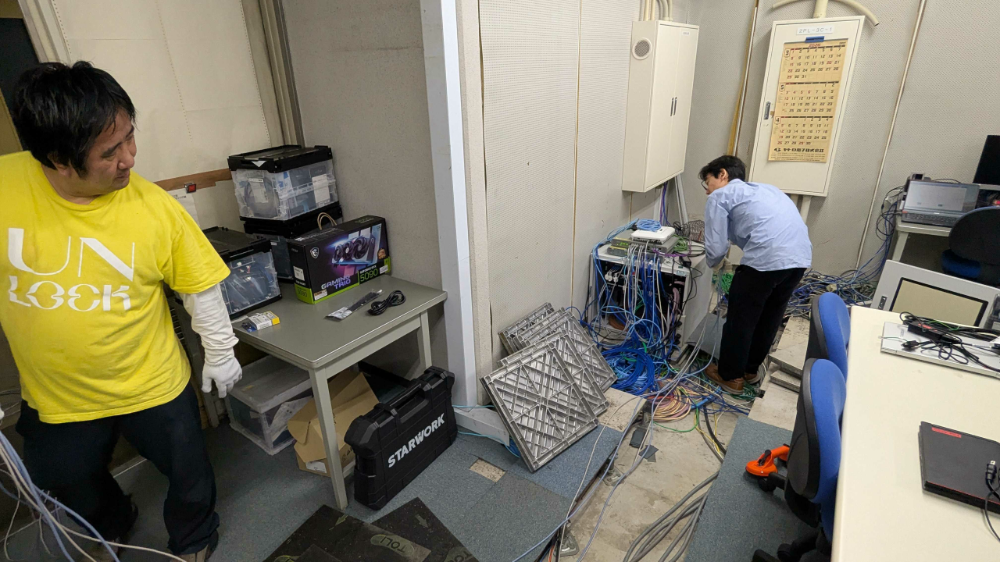
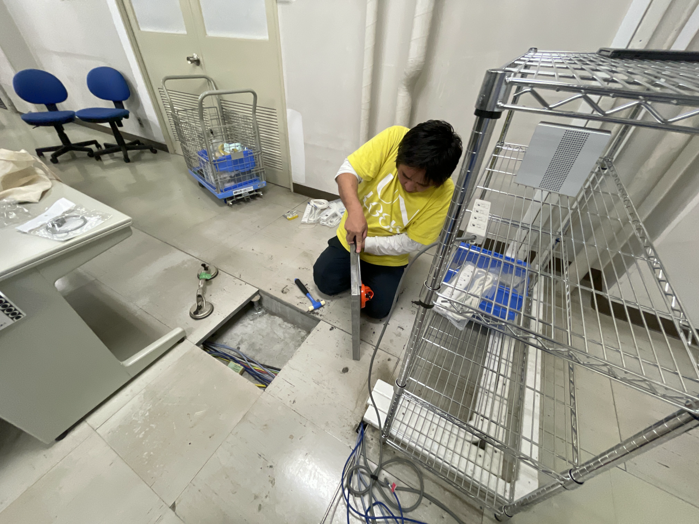
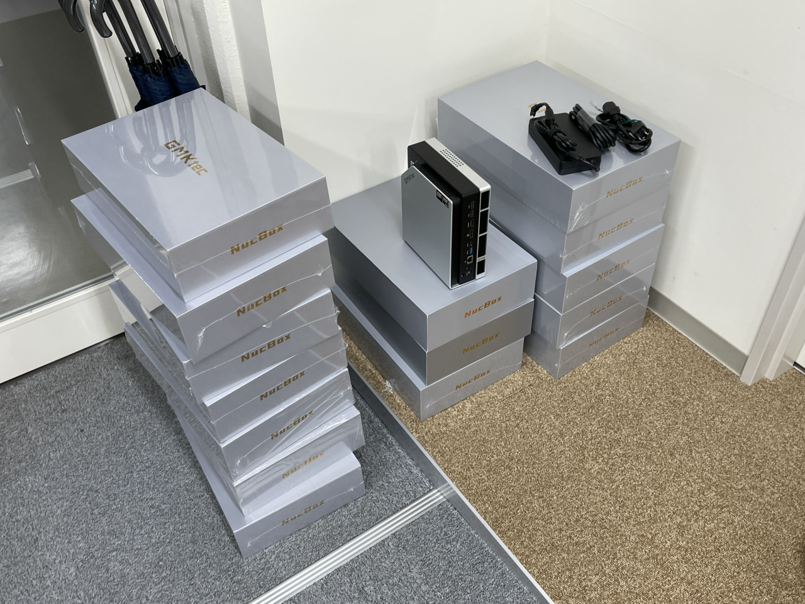

# 筑波大学 情報科学類 情報科学特別演習 特別枠 「ローカル生成 AI サーバーを構築してみよう」 教材ページ

2026/06/01 登 初版作成

このページは、[**筑波大学 情報科学類 情報科学特別演習 特別枠 「ローカル生成 AI サーバーを構築してみよう」**](https://sites.google.com/view/pis-univ-tsukuba/education/ai-coins-special/) の教材ページです。

## ステップ

以下のステップを、順に実行すると、ある程度実用的な AI サービスを、大学のグローバル IP アドレスで大学のサブドメインで立ち上げ、自分で利用するほか、友達などに提供して使ってもらうことが可能になります。

- [**ステップ 1. グローバル IP アドレスとサブドメインの割り当てを受けよう**](./Step1_IP_Address_and_Domain_Name_Assignment/Step1_IP_Address_and_Domain_Name_Assignment.md)

- [**ステップ 2. AI サーバーマシンをセットアップして筑波大学のグローバル IPv4 アドレスと大学サブドメインを付与し、簡単な Web サーバを立ち上げよう**](./Step2_Server_Machine_Setup_and_WebServer/Step2_Server_Machine_Setup_and_WebServer.md)

- ステップ 3. いよいよ AI サービスの構築方法を解説。現在教材制作中。数日間お待ちください。それまではステップ 1, 2 をお試しください。

## 受講者の方々へのお願い

1. 本実習は、インターネットに対して、大学の公式ドメイン名でアクセス可能な Web サーバや AI サービスを公開する内容が含まれています。実習を開始する前に、[「筑波大学における情報システム利用のガイドライン」](https://www.t-act.tsukuba.ac.jp/flow/pdf/net-use.pdf) をよく読み、理解をした上で、実習をお願いします。
1. サイバーセキュリティ対策に関する教材を勉強しながら、実習を行なってください。インターネットや図書館等や書店等で、各自に適合したものを探すことをお勧めします。なお、本教材の制作者も、[「簡単・効果的なサイバーセキュリティ対策入門とその裏側の原理」(2026/04/15 版)](https://dnobori.cyber.ipa.go.jp/ppt/download/20260416_benren/) という講習資料を作成して PDF で公開していますので、参考になさって下さい。
1. 貸与する機材は、故障することがありますので、中の SSD に保存するデータのうち大切なデータは、必ず自前でバックアップを取ってください。
1. 貸与する機材に、他人に読まれたくないデータを保存する場合は、返却時には自らの責任でデータを消去してください。消去しなかった場合、他人に保存データを読み出される可能性があります。また、機材設置場所から機材が盗まれたり、設定不備等で不正侵入されたりした場合は、同様に他人にデータが読まれる可能性があります。他人に読まれると困るデータは保存しないことをお勧めします。
1. 本実習で使用する様々な手法やソフトウェア、あるいは本教材の内容には、バグ・脆弱性がある可能性があります。その結果、本実習受講者が保有または管理する情報に係る機密性・完全性・可用性が喪失する可能性があります。そのようなセキュリティ・インシデントが発生した際に問題になるような情報 (たとえば、個人の内面に関わるプライバシ情報、他者から預かっている営業秘密情報等) は、本実習の機材や教材を用いて保管・処理しないでください。

------

