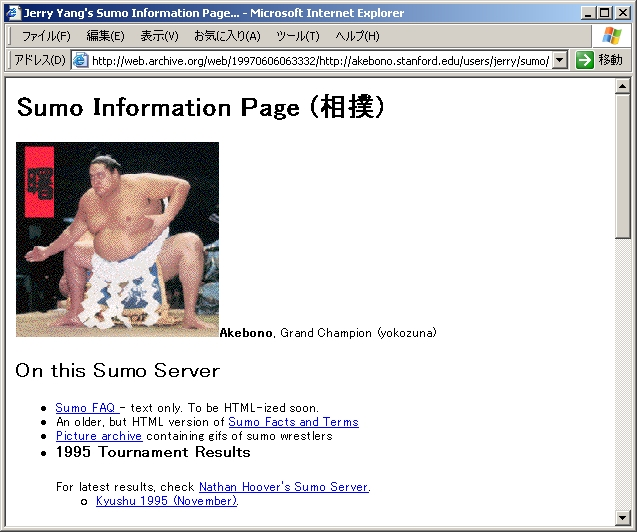
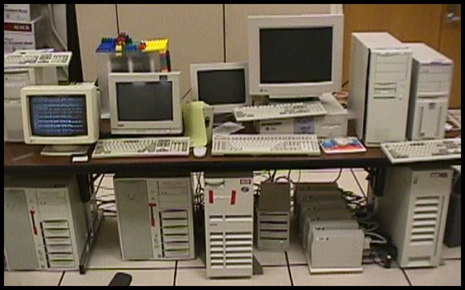

【ステップ 1. IP アドレスとドメイン名の割り当てを受ける】

# 1. 概説

## 1.1. 大学において学生がグローバル IPv4 アドレスを利用できることの重要性
コンピュータに関する基本的・基礎的な知見やセキュリティリテラシを修得するためには、サーバを運用する必要がある。そのために、グローバル IPv4 アドレスを少なくとも 1 個割り当てを受けることは、必須である。

さらに、現在日本人は、デジタル本流領域 (クラウドコンピューティング、OS、ネットワーク、仮想化、セキュリティ、AI 等) の技術を研究し、国際競争力のある新たなシステムを作り、プラットフォーマーになることが社会的に求められている。そのためには、大学の学生の方々は、皆、グローバル IPv4 アドレスをいくつも割り当てを受け、これを自ら操縦し、自作基盤システムにつなぎこむことが必要である。


## 1.2. 大学サブドメインを学生が研究目的で取得できることの重要性

大学の学生等の研究者が、研究のためのグループを立ち上げ、当該大学のサブドメインを取得し、その上で、自作システムを立ち上げることができるようにすることは、歴史的にみて、とても重要である。

たとえば、米国のスタンフォード大学は、`stanford.edu` というドメイン名を有しているが、同大学は、昔から、`希望プロジェクト名.stanford.edu` を学生にかなり柔軟に付与してきた。これにはほとんどコストがかからず、莫大な価値創出につながることが、以下のとおり実証されている。

- スタンフォード大学で生まれた初期の大規模プラットフォーマーである Yahoo! 社は、`akebono.stanford.edu` というサブドメインで生まれた。実のところ、これは、Yahoo! 創業者ジェリー・ヤン氏が、遊び目的で、日本の相撲に関する Web ページを作成していたのである。同氏は、その Web ページのサブディレクトリとして、`http://akebono.stanford.edu/yahoo` というものを作った。これが後の `yahoo.com` に発展していったのである。  
    
  (スクリーンショットは、https://mohritaroh.hateblo.jp/entry/20051210/akebono より引用。)

- 同大学で生まれた、その後の大規模プラットフォーマーである Google 社は、`google.stanford.edu` というサブドメインで生まれた。セルゲイ・ブリン氏とラリー・ペイジ氏は、Intel 社からもらってきた 2 台の中古コンピュータを用いて、`google.stanford.edu` 上で Linux を用いて検索エンジンを試作した。すると、大量のアクセスが発生したので、急いで Linux を用いてロードバランス (負荷分散) とフォールトトレランス (障害耐性) のソフトウェア基盤をプログミングして自作し、安価なコンピュータを大量に分散利用できる仕組みを構築した。これが後の `google.com` に発展していったのである。  
    
  (写真は、https://gigazine.net/news/20061118_google_computer_storage/ より引用。)

上記のいずれの例も、大学のトップレベルドメインの直下のサブドメインであった。

筑波大学でも、`tsukuba.ac.jp` の直下に、たとえば `google.tsukuba.ac.jp` というようなサブドメインを学生が研究目的で取得することができるようにすることが、大きな価値を創出するための秘訣である可能性は高い。しかしながら、筑波大学は、米国の上記のような優れた業績を挙げている大学と比較して、学生が `tsukuba.ac.jp` の直下のサブドメインを取得することは、なぜか、相当に困難となってしまっている。そこで、本講義では、代わりに、`start.coins.tsukuba.ac.jp` という `tsukuba.ac.jp` の 2 階層下のドメインを用意し、その下に `任意の文字列.start.coins.tsukuba.ac.jp` というサブドメインを自由に割り当てることができるようにして、できるだけ米国の優良大学の環境に近い環境の実現に努める。

# 2. 本講義用のグローバル IPv4 アドレスとドメイン名の概要
start.coins の講義を受ける方は、1 人 1 個ずつ、筑波大学のグローバル IPv4 アドレスの割り当てと、`start.coins.tsukuba.ac.jp` の配下のサブドメインの割り当てを受けることができる。割当期間としては、少なくとも、当該年度内は利用可能である。


## 2.1. 本講義用のグローバル IPv4 アドレス
筑波大学は、主に
```
130.158.0.0/16 (65,536 個)
```
と
```
133.51.0.0/16 (65,536 個)
```
の 2 つのある程度大きな IPv4 ブロックを保持している。これらのグローバル IPv4 アドレスを用いて、自らサーバを構築・運用することにより、コンピュータやネットワーク等に係る基本的・基礎的なリテラシ修得や技術研究を行なうことが可能である。


この中で、start.coins は、ひとまず、次の IPv4 アドレスの割り当てを受けている。この中から 1 人 1 個、IPv4 アドレスを割り当てる。
```
130.158.230.0/26 (64 個)
```

ここで、`130.158.230.0/26 (64 個)` という表記に込められた意味は、かなり難解である。原理的には、130.158.230.0 ～ 130.158.230.63 の 64 個が利用可能である。しかし、いろいろ複雑な事情があり、先頭・末尾の 130.158.230.0 と 130.158.230.63 は、利用しづらい。また、末尾から 1 個前の 130.158.230.62 も、利用しづらい。そこで、実際に利用できるのは、130.158.230.1 ～ 130.158.230.61 の合計 61 個である。

(理想的なコンピュータネットワークの講義であれば、ここで、なぜ、このような制約が生じるのかの説明が始まる。しかしながら、それは相当程度に高度な内容になってしまい、挫折する原因になってしまう。そこで、ここでは、そのような制約がある理由の説明は、ひとまず、省略をする。)


## 2.2. 本講義用のドメイン名
筑波大学は、従前より、主に、
```
tsukuba.ac.jp
```
というドメインを保持している。ドメイン保持者は、そのドメインのより下位のドメイン (サブドメイン) を作成し、そのサブドメインの管理権を委譲することができる。伝統的に、
```
tsukuba.ac.jp
```
というドメインは、筑波大学の情報環境機構あるいは学術情報メディアセンターが管理している。このサブドメインとして、情報科学類のドメイン
```
coins.tsukuba.ac.jp
```
というものがある。この `coins.tsukuba.ac.jp` は、情報科学類の計算機運用委員会が管理している。情報科学類の計算機運用委員長に近時就任した鹿野氏は、さらなるサブドメインである
```
start.coins.tsukuba.ac.jp
```
を定義し、2026 年 5 月末頃、これを本講義で利用することができるようにうまく手配した。


このように、ドメインの仕組みにおいては、どんどんと、下位に向かって、サブドメインを定義し、管理権を委譲することができる。

(ここで、本来であれば、その原理や仕組みを解説すべきである。しかし、それはやはり挫折の原因となってしまう。そのため、本講義においては、ここでは、ひとまず、細かい原理は省略をする。)


`start.coins.tsukuba.ac.jp` は、さらに下位に向かって、サブドメインを定義し、管理権を委譲することができる。


本講義を受講される方は、`start.coins.tsukuba.ac.jp` のサブドメインを、必要な数だけ、いくつでも作成して、自らの構築するサーバーに関連付けることができる。


# 3. どのように割り当てが管理されているのか

## 3.1. IPv4 アドレスの割り当て管理方法

本講義の受講者は、前述のとおり、`130.158.230.1` ～ `130.158.230.61` の 61 個の IPv4 アドレスを、少なくとも 1 人 1 個、割り当てを受けることが可能である。

IPv4 アドレスの割り当てを受ける方法は、通常は、組織における煩雑な申請プロセス (たいていの場合、ここに政治的プロセスが付着する) あるいは ISP における申込や料金の支払い等が必要である。そのような手続きは、学習意欲を抑制する原因となってしまう。そこで、本講義では、受講者が IPv4 アドレスの割り当てを受ける際には、特段の申請プロセスは不要とし、自ら宣言を行なうだけで IPv4 アドレスを 1 人あたり少なくとも 1 個割り当てを受ける方法を用意した。その方法は、次のとおりである。


まず、3C206 計算機室に、上記写真のようなノートパソコン (`start-maintepc1` というラベルが貼られている) が設置されている。このノートパソコンは、画面がロックされていない状態で、常時、デスクトップが開かれた状態になっている (3C206 に出入りする人々は、悪さをしないという点で信用されている)。


このノートパソコンには、デスクトップに `ZoneDef.config` というテキストファイル (へのショートカット) が置いてある。これはノートパソコン上の「秀丸エディタ」というテキストエディタで常時開かれている (もし、閉じられていれば、自分で開くこと)。(なお、この「秀丸エディタ」は、シェアウェアであるが、きちんと、ライセンスを購入したものである。)


この「秀丸エディタ」上の `ZoneDef.config` の内容をよくみると、上記写真の赤枠のように、`130.158.230.x` の IPv4 アドレスの割り当てを自ら行なった講義受講者が、自らの氏名や学籍番号等を宣言する欄がある。

この赤枠の欄の下に、IPv4 アドレスを欲する受講者は、自身の 1 個の新たな IPv4 アドレスの使用開始の宣言を追記することとなる。その追記は、上記画面の赤枠のサンプルを参考にして (この赤枠部分を全部コピー＆ペーストし、下に付け足せば良い)、緑色の文字で記載されている説明書きに基づいて、実施される必要がある。

注意点として、決して、すでに他の人が `ZoneDef.config` 上で割り当て宣言している IPv4 アドレスを重複利用してはならない。そのようなことを行なったならば、たちまち通信は不安定になり、先取者から非難されるであろう。


## 3.2. start.coins.tsukuba.ac.jp のサブドメインの割り当て管理方法

実は、IPv4 アドレスの割り当てを受ける瞬間に、自動的に start.coins.tsukuba.ac.jp のサブドメインの割り当ても行なわれるのである。


上図の赤枠を拡大表示するなどして、是非とも注目していただきたいのであるが、この赤枠のような表記で IPv4 アドレスの割り当てを受ける場合は、あわせて、 `start.coins.tsukuba.ac.jp` のサブドメイン名も自ら定義する仕組みになっている。


そして、サブドメイン名として付加される文字列部分 (これを、サブドメインのためのドメインラベルという。) は、半角英数字で自分で決めることが可能である。ただし、サブドメインのためのドメインラベルは、早い者勝ちである。すでにレコード上に存在するドメインラベルとの重複は、許容されない。


たとえば、太郎さんという受講者がいて、`supertaro` というサブドメインのためのドメインラベルを使用したいと考えたとする。この場合、サブドメイン全体のフル表記 (これを FQDN = "Fully Qualified Domain Name" というが、このようなややこしい専門用語は挫折の元であるから、当初は覚える必要はない) は、`supertaro.start.coins.tsukuba.ac.jp` となる (ここで、コンピュータネットワーク原理主義者からは、FQDN というからには末尾に `.` を付けるべきである等の批判が考えられるが、そのような部分に拘ることは挫折原因となるので、これも省略する)。


だが、すでに一太郎さんという受講者がいて、その人が、先ほどすでに `supertaro.start.coins.tsukuba.ac.jp` を `ZoneDef.config` に宣言していたとする。この場合、早い者勝ちルールにより、太郎さんは、`supertaro` を使用することはできない。


慣習によれば、ドメインのサブドメインの確保は、原則として、早い者勝ちである。たとえば、 `.com` というドメインのサブドメイン名として、`supertaro.com` を取得したい者が 2 名いたならば、取得成功者は、早い者勝ちで決まる。このような早い者勝ちを実現するロジックは、通常は、ドメイン管理組織のコンピュータ上において、申請が先に到達したほうのみの申請を通し、ほとんど同時に、だが、わずかな時間差で後れたほかの申請を拒絶する、ややこしい並行同期処理プログラムによって実装されている。しかし、この講義で使用する `start.coins.tsukuba.ac.jp` というドメイン名の管理の仕組みは、上記のとおり `ZoneDef.config` というファイルによって性善説で実施されている。そして、`ZoneDef.config` は、3C206 室に来たら、誰でも書き換え可能なのである。これは、本講義の受講者が、既に他人が利用中のサブドメイン名を勝手に横取りするようなことはしないであろうという信用の下で機能するモデルである。加えて、そもそも本講義の受講者以外の情報科学類生が、3C206 室に夜中にこっそりと入ってきて、勝手に `ZoneDef.config` の内容を書き換えることは無いであろうという信用の下で機能するモデルである。


# 4. いよいよ、グローバル IPv4 アドレスとサブドメイン名を取得してみよう

上記で述べたとおり、3C206 にあるノートパソコンで `ZoneDef.config` というファイルを編集し、IPv4 アドレスとドメイン名を取得してみよう (ただし、これが許容されるのは、start.coins の受講者に限る。なぜならば、IPv4 アドレスは、前述のとおり 61 個しかなく、すぐに在庫が無くなってしまうためである)。


