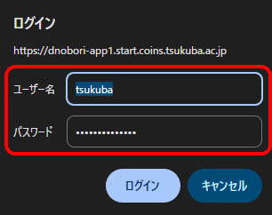
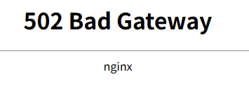

**【ステップ 4. Nginx の設定を追加しよう】**

2026/06/22 登 初版作成

- [1. はじめに - nginx の必要性](#1-はじめに---nginx-の必要性)
  - [1.1. リバースプロキシとは](#11-リバースプロキシとは)
  - [1.2. なぜ、今回の作業で、リバースプロキシが必要か](#12-なぜ今回の作業でリバースプロキシが必要か)
    - [1.2.1. HTTP や HTTPS で接続が確立されるまでの背後の仕組み](#121-http-や-https-で接続が確立されるまでの背後の仕組み)
    - [1.2.2. 本来は、HTTP / HTTPS の URL では任意のポート番号 (1 ～ 65535) を指定可能である](#122-本来はhttp--https-の-url-では任意のポート番号-1--65535-を指定可能である)
    - [1.2.3. HTTP/HTTPS の URL においてポート番号の指定を省略した場合のポート番号は、80 番、443 番と決まっている](#123-httphttps-の-url-においてポート番号の指定を省略した場合のポート番号は80-番443-番と決まっている)
    - [1.2.4. 企業のファイアウォールが HTTP 80 番, HTTPS 443 番以外の通信を遮断するようになってしまった](#124-企業のファイアウォールが-http-80-番-https-443-番以外の通信を遮断するようになってしまった)
    - [1.2.5. したがって単一のサーバ・単一の IP アドレス上で複数の Web サーバを稼働させるには TCP 443 番を共有しなければならない](#125-したがって単一のサーバ単一の-ip-アドレス上で複数の-web-サーバを稼働させるには-tcp-443-番を共有しなければならない)
    - [1.2.6. 単一の IP アドレスで、TCP 443 番ポート番号を用いて、複数の Web サーバを公開するためには、「リバースプロキシ」を用いて、ホスト名で振り分け処理をする必要がある](#126-単一の-ip-アドレスでtcp-443-番ポート番号を用いて複数の-web-サーバを公開するためにはリバースプロキシを用いてホスト名で振り分け処理をする必要がある)
    - [1.2.7. リバースプロキシは、SSL (TLS) の証明書提示処理および暗号化処理を、各 Web サーバプログラムに代わって実施してくれる](#127-リバースプロキシはssl-tls-の証明書提示処理および暗号化処理を各-web-サーバプログラムに代わって実施してくれる)
    - [1.2.8. リバースプロキシでの振り分けでは、https://●●/ の「●●」のようなホスト名で振り分けすることが簡単である](#128-リバースプロキシでの振り分けではhttps-ののようなホスト名で振り分けすることが簡単である)
    - [1.2.9. リバースプロキシの仕組みの詳細はさらに複雑であるが、これを理解しようとするとニワトリタマゴ問題が発生するので、細部を省略して大変適当に設定例を示す](#129-リバースプロキシの仕組みの詳細はさらに複雑であるがこれを理解しようとするとニワトリタマゴ問題が発生するので細部を省略して大変適当に設定例を示す)
- [2. リバースプロキシの具体的設定手順](#2-リバースプロキシの具体的設定手順)
  - [2.1. 簡単なユーザー認証 (Basic 認証) のパスワードの設定](#21-簡単なユーザー認証-basic-認証-のパスワードの設定)
  - [2.2. nginx の設定ファイルの編集](#22-nginx-の設定ファイルの編集)
  - [2.3. nginx 設定ファイルのチェック](#23-nginx-設定ファイルのチェック)
  - [2.4. nginx 設定への適用](#24-nginx-設定への適用)
  - [2.5. 結果の確認](#25-結果の確認)


# 1. はじめに - nginx の必要性
【ステップ 2】では、「nginx」という Web サーバソフトウェアをインストールし、貸与しているサーバコンピュータ上で、とても初歩的な Web サイトを作成し、SSL (HTTPS) で公開する作業を行なった。

今から、いよいよ、【ステップ 5】以降で、AI プログラムをサーバコンピュータ上で動作させる。この際、動作させる AI プログラムに対して、インターネットからのアクセスを許容するために、【ステップ 2】でインストールした「nginx」という Web サーバを用いると便利である。

## 1.1. リバースプロキシとは
nginx は、「リバースプロキシ」として利用可能な Web サーバソフトウェアの一種である。

リバースプロキシは、インターネット側から、サーバに対して、アクセスしようとする、ユーザの接続リクエストを、一旦、通信レベルでは完全に終端した上で、サーバの実体に対して、伝言ゲームのように通信を中継する仕事を行なう。

## 1.2. なぜ、今回の作業で、リバースプロキシが必要か
今回のサーバ構築では、1 台のサーバ、1 個のグローバル IP アドレス上で、複数個の、互いに独立分離したサーバ機能を動作させる可能性がある。この際に、リバースプロキシの仕組みが必要となる。

必要性を示すために、HTTP や HTTPS で接続が確立されるまでの背後の仕組みを、簡単に解説する。

### 1.2.1. HTTP や HTTPS で接続が確立されるまでの背後の仕組み
単一のサーバマシン上で、かつ、単一の IP アドレスで動作する、複数個の相互独立のサーバに、インターネット経由で、`https://●●/` という URL でアクセスすることを考える。

この `●●` の部分は、ホスト名 (【ステップ 1】で前述したとおり、より正確には、FQDN = "Fully Qualified Domain Name") が入る。

ここで、【ステップ 1】で、自分のハンドルネームが `◎` の場合、
- `◎.start.coins.tsukuba.ac.jp`  
のみでなく、
- `◎-app1.start.coins.tsukuba.ac.jp`
- `◎-app2.start.coins.tsukuba.ac.jp`
- `◎-app3.start.coins.tsukuba.ac.jp`
- `◎-app4.start.coins.tsukuba.ac.jp`

の追加の 4 個のドメインラベルを含んだサブドメイン名 (FQDN) を DNS サーバに登録していただいたことを思い出して欲しい。

上記の `◎.start.coins.tsukuba.ac.jp`、`◎-app1.start.coins.tsukuba.ac.jp`、`◎-app2.start.coins.tsukuba.ac.jp`、`◎-app3.start.coins.tsukuba.ac.jp`、`◎-app4.start.coins.tsukuba.ac.jp` の 5 個の DNS レコードには、受講者 (あなた) に割り当てられた、単一の IP アドレスが設定されている。

この状態で、インターネット上の任意の Web 閲覧者 (訪問者) が、たとえば、

- `https://◎.start.coins.tsukuba.ac.jp/` 

あるいは

- `https://◎-app1.start.coins.tsukuba.ac.jp/`

にアクセスしようとしたとする。

まずは、`https://◎.start.coins.tsukuba.ac.jp/` にアクセスしようとした、としよう。

このとき、Web 閲覧者の Web ブラウザは、まず、`◎.start.coins.tsukuba.ac.jp` というホスト名から、IP アドレスを取得しようとする。この際に、【ステップ 1】で設定していただいた、`.start.coins.tsukuba.ac.jp` という親ドメインを掌る DNS サーバに対して、「`◎.start.coins.tsukuba.ac.jp` というホスト名の IP アドレスを教えてください。」という要求を送付する。当該 DNS サーバは、「はい。`130.158.230.x` です。」という応答を返す。

次に、Web 閲覧者の Web ブラウザは、前記 DNS 応答で得られた `130.158.230.x` という IP アドレスに対して、原則として、「TCP」というプロトコル (通信の決まり) を用いて、接続を確立しようとする。TCP とは、Transmission Control Protocol (伝送制御プロトコル) の略である。インターネットの世界における万国共通語のようなものである。

### 1.2.2. 本来は、HTTP / HTTPS の URL では任意のポート番号 (1 ～ 65535) を指定可能である

ここで、TCP というプロトコルで接続を確立しようとする際には、これもまたややこしいが、「接続先ポート番号」という接続確立時の相手方サーバプログラムを識別する整数値 (1 から 65535 までの任意の整数を取ることができる) を指定することができる。このポート番号は、本来、HTTP や HTTPS の URL の一部分として指定することができる。たとえば `https://◎.start.coins.tsukuba.ac.jp:★/` のように記載したとき、接続先ポート番号としては、`★` を指定したことになる。

- `https://◎.start.coins.tsukuba.ac.jp:1234/`

と書くと、`◎.start.coins.tsukuba.ac.jp` の TCP ポート `1234` に HTTPS プロトコルで接続しようとしていることになる。

そして、単一のサーバ・単一の IP アドレス上で、複数のサーバプログラムを同時に動作させるとき、原則として、ある 1 個のポート番号 (上述のとおり、単なる 1 ～ 65535 までの整数値である) を用いて接続を受付けることができるサーバプログラムは、1 個のみである。

たとえば、Web サーバ #1 と、Web サーバ #2 を、単一のサーバ・単一の IP アドレス上で同時に動作させることを考える。このとき、

1. Web サーバ #1 は、TCP ポート 123 で接続を受付ける。
1. Web サーバ #2 は、TCP ポート 456 で接続を受付ける。

のように構成すれば、単一のサーバ・単一の IP アドレス上で、Web サーバ #1 と Web サーバ #2 とは、共存できる。そして、Web 閲覧者は、

1. `https://◎.start.coins.tsukuba.ac.jp:123/`  
   という URL を指定してアクセスすると、このサーバ上の Web サーバ #1 に到達し、
2. `https://◎.start.coins.tsukuba.ac.jp:456/`
   という URL を指定してアクセスすると、このサーバ上の Web サーバ #2 に到達する、

ということになる。

前述のとおり、ポート番号は 1 ～ 65535 という、かなり多くの数をとれる。したがって、本来であれば、単一のサーバ・単一の IP アドレス上で、Web サーバ #1、Web サーバ #2、Web サーバ #3, ... といろいろ動作させる際に、事実上十分な数のサーバを立ち上げ、同時並行的に稼働させることができる。

### 1.2.3. HTTP/HTTPS の URL においてポート番号の指定を省略した場合のポート番号は、80 番、443 番と決まっている
上述のとおり、HTTP/HTTPS の URL 内では、接続先サーバの TCP ポート番号を指定することも **できる**。逆に言えば、指定しないこともできる。指定しない場合、**HTTP の場合は `80` 番ポート、HTTPS の場合は `443` 番ポートが使用される**、ということに決まっている。このように、インターネットのいろいろなプロトコルにおいて、ポート番号を指定せずに単に接続先のホスト名 (または IP アドレス) のみを指定した場合に、黙示的に利用される標準のポート番号を、**「デフォルトポート番号」** などと呼ぶ。

なぜ HTTP のデフォルトポート番号は 80 番、HTTPS のデフォルトポート番号は 443 番なのか。これらの数字の値には、たいした意味はない。単に、インターネットの黎明期 (1990 年代以前) において、「私は、HTTP という仕組みを提唱する」とか「私は、HTTPS という仕組みを思い付いた」と宣言した、元気の良い人たちが、整数の 1 番から始まる共用ポート番号宣言表 (このポート番号表は、単に私人たちの集団が適当に作成して昔から公開しているものであり、何らの公的な拘束力はない。この表に記載されていないからといってそのポート番号を利用してはならない訳ではないし、記載されているといって、そのポート番号をその通りに利用しなければならない訳でもない) のうちできるだけ小さい数字でかつ空いている数字をもらい、そこに、自分たちのプロトコルを紐付ける宣言をしたことによる (要するに、あるプロトコルを思い付いた人は、早い者勝ちで、ポート番号表上の、空いているポート番号を取得することになっている)。

### 1.2.4. 企業のファイアウォールが HTTP 80 番, HTTPS 443 番以外の通信を遮断するようになってしまった
HTTP, HTTPS では、サーバ側として、任意のポート番号を利用でき、URL でその都度指定できる。HTTP, HTTPS 以外においても、ほとんどの TCP ベースのプロトコルで、「サーバ」という概念があるものは、凡そすべてサーバ側のポート番号を変更しても問題なく稼働する (前述のとおり、ポート番号には数字としての意味はなく、単なるラベルであるためである)。このことから、TCP においては、ポート番号のみをもとに、通信内容 (プロトコルの種類) を推定することは、技術的に不可能である。通信内容を推定するためには、流れるデータの中身を見なければならない。

ところで、いろいろな企業においてインターネット通信システムを管理する、今でいう IT システム部門の社員たちは、たいていの場合、技術的素人で構成されている。これらの素人たちは、TCP ポート番号が通信の内実を識別すると誤解していることが多い。そして、企業経営者においては、特定の通信の種別のみを疎通させ、それ以外の通信を是非とも遮断したいという、(実のところ実現不能な) 願望が存在する。この企業経営者の本来不能な願望を一応叶えるために、技術的素人社員たちは、TCP ポート番号をホワイトリスト方式で規制することができると誤解した。そして、たとえば、企業経営者が「安全な通信のみ許可するように」と命じたので、技術的素人たちは、「HTTP, HTTPS の通信は許容するが、それ以外の通信は遮断すればよいのかな」と考えた、とする。前述のとおり HTTP のデフォルトポート番号は 80 番、HTTPS のデフォルトポート番号は 443 番である。そこで、技術的素人たちは、**TCP の 80 番と 443 番のみを疎通するファイアウォール設定** というものを、企業のネットワークに投入し始めた。

このように、TCP の 80 番と 443 番のみを疎通するファイアウォール設定が、さまざまな企業のネットワークで蔓延する結果となった。これはセキュリティ的にたいした意味はない。誰でも、TCP 80 番と 443 番を用いて、HTTP や HTTPS 以外のプロトコルを通信させることができるため、前述の例における企業経営者の願望は実現されていない。しかし、一見して実現されているように錯覚されてしまう。

30 年間程度にわたって、いろいろな企業ファイアウォールに、上記のような素人技術者的設定がなされた結果、インターネット上においては、TCP 80 番、TCP 443 番以外でサーバを公開しても、企業内のユーザからのアクセスが期待できない、という状態になってしまった。

そのうちに、サイバー攻撃者が、企業内のコンピュータ上に埋め込んだバックドアとの通信は、TCP 443 番の HTTPS 通信に偽装するようになった。また、HTTP や HTTPS の初期段階では想定されていなかったような、HTTP の仕組みにあてはまらない任意のデータを伝送する WebSocket という仕組みが、HTTP や HTTPS 上で動作するようになった。事実上任意の通信が、結局 TCP 443 番 (HTTPS) を介して常時行なわれるようになってしまった。前記の企業経営者の願望である、セキュリティ上の理由で通信内容を制限したいという要求は、結局技術的に叶えられていないのに、TCP 80 番、443 番のみ通しそれ以外は遮断するという慣行のみが広まってしまい、折角もともと TCP の仕組みに内在されている、ポート番号 1 ～ 65535 番のすべての数字を任意に利用してサーバを立ち上げることができるというインターネット上の番号利用効率が急激に低下した。

なお、余談であるが、先に TCP の通信内容を知ることは、ポート番号のみの検査では不可能であり、通信の内容を見る必要がある、と述べた。ところが、通常 TCP 443 番は SSL (TLS) という通信で暗号化を行なうので、結局、ネットワーク上の監視主体 (たとえば、前記のような、企業経営者に命じられた IT 部門のの社員) は、TCP 443 番の通信の内容を知ることは、暗号を解読しない限り、不可能である。そして、SSL (TLS) の暗号は、現在では事実上解読不能な強度がある。ネットワーク上の監視主体は、TCP 443 番の通信の内容を知ることは、通常できない。(例外として、クライアント側のコンピュータの管理者の許諾を得た上で、無理矢理通信内容をいったん解読して、再暗号化することで、中身を見ることができる場合がある。しかし、この方法では通信の秘匿性が損なわれ、SSL (TLS) を用いている意味がなくなってしまう。)

### 1.2.5. したがって単一のサーバ・単一の IP アドレス上で複数の Web サーバを稼働させるには TCP 443 番を共有しなければならない
訪問者側のおかしな環境 (前述のような企業ファイアウォール) を想定すると、デフォルトポート番号である HTTP の 80 番、HTTPS の 443 番以外の宛先に対する通信が遮断されてしまう現代インターネットにおいては、**何としてでも、HTTPS 用の TCP 443 番ポート番号を用いて Web サーバを公開する** ことが必須である。今回の講義のように、訪問者が自分自身または友人程度という場合であれば、実はポート番号にこだわる必要は少ない。しかし、本講義を受講される方々には、今後、いろいろな Web サービスを、インターネット上で不特定多数の方々に対して公開され、大きな利益を挙げるような計画をされる方々が一定程度存在すると思われる。そこで、今から Web サーバの立ち上げ方法を習得される場合は、**必ず、HTTPS 用の TCP 443 番ポート番号を用いて、複数の Web サーバを単一の IP アドレス上で公開する** という方法を実践されることをお勧めする。

### 1.2.6. 単一の IP アドレスで、TCP 443 番ポート番号を用いて、複数の Web サーバを公開するためには、「リバースプロキシ」を用いて、ホスト名で振り分け処理をする必要がある

前述のとおり、原則として、1 つの Web サーバプログラムは、1 個の TCP ポート番号を専有する必要がある。そして、すべての Web サーバプログラムは、是非とも TCP 443 番ポートを専有したい。そうすると、複数の Web サーバプログラムで、単一の「TCP 443 番」というポートを共有する必要がある。これはかなり難しい課題である。

TCP の通信処理は、OS (Linux 等) の「カーネル」と呼ばれる基礎的部分が掌っている。他方、Web サーバプログラムは、OS 上で動作する、ユーザモードと呼ばれる、アプリケーションプログラムとして実装されている。サーバプログラムが、OS のカーネルに対して、「私に TCP 443 番ポートを着信目的で利用させろ」と自分自身を「登録」すると、インターネットから届く TCP 443 番宛通信が、そのサーバプログラムに到達する。だが、この「登録」処理は、早い者勝ちになっている。2 個以上の Web サーバプログラムが、TCP 443 番ポートに、自分自身を「登録」しようとすると、先に登録しようとした者が勝ち、後の登録は OS によって却下されてしまう (全く動作しないこととなる)。

そこで、このような競合を避けるため、近年の慣習としては、数個の Web サーバプログラムを稼働させる場合には、TCP 443 番と全然異なる TCP ポート番号 (相互に異なる TCP ポート番号) で Web サーバプログラムを稼働させておくことが一般的である。そして、これらの Web サーバプログラムとは全く独立させた、単一の、常に TCP 443 番を専有し、TCP 443 番に対して着信があった HTTPS 接続を、意図した事前登録ルールに基づき、適切な Web サーバプログラムに振り分ける、かなり軽量な「リバースプロキシ」と呼ばれるプログラムを常時稼働させる。当該リバースプロキシは、自分自身を、唯一の「TCP 443 番を専有するプログラム」として OS に登録する。リバースプロキシに対して、インターネット経由で、閲覧者からアクセスがあったならば、これを、リバースプロキシが一旦受信した上で、通信を各 Web サーバにその都度振り分ける。

### 1.2.7. リバースプロキシは、SSL (TLS) の証明書提示処理および暗号化処理を、各 Web サーバプログラムに代わって実施してくれる

「HTTPS」という、通信経路を暗号化する Web 通信の仕組みが一般的となった現代におけるリバースプロキシの意義は、振り分け処理以外に、「HTTPS」という仕組みの実現に必要な SSL (TLS) の証明書提示処理および暗号化処理を、Web サーバプログラムに肩代わりして、担ってくれる点にある。

【ステップ 2】では、一応、今回の講義で利用する `任意の文字列.start.coins.tsukuba.ac.jp` というホスト名で利用可能な共通の SSL 証明書を nginx というリバースプロキシに設定する方法を紹介した。これにより、すでに【ステップ 2】において `https://◎.start.coins.tsukuba.ac.jp/` という「HTTPS」で始まる Web ページへのアクセスに成功しているはずである。この「HTTPS」という仕組みは、従来暗号化されていなかった「HTTP」という通信の仕組みにおける通信内容を、「SSL (TLS)」という暗号化の仕組みで単純包含することにより、インターネット経路上の盗聴者から盗み見または改ざんされることを防止するための仕組みである。

「SSL (TLS)」という暗号化の仕組みは、とても高度複雑であり、数年ごとに新しい規格が登場するので、追従が煩雑である。これを各 Web サーバリバースプロキシに任せることにより、SSL (TLS) 部分を一本化でき、実装や管理が簡単になるというメリットがある。

### 1.2.8. リバースプロキシでの振り分けでは、https://●●/ の「●●」のようなホスト名で振り分けすることが簡単である

リバースプロキシが、動作している複数の Web サーバに、アクセスしてきた閲覧要求を振り分けるためには、いろいろな方法がある。最も簡単な方法は、`https://●●/` の `●●` の部分の文字列によって振り分ける方法である。本講義の以下のサンプル例では、この手法を用いて、サーバの構築を行なう。

ここで、ふたたび、【ステップ 1】で、自分のハンドルネームが `◎` の場合、
- `◎.start.coins.tsukuba.ac.jp`  
のみでなく、
- `◎-app1.start.coins.tsukuba.ac.jp`
- `◎-app2.start.coins.tsukuba.ac.jp`
- `◎-app3.start.coins.tsukuba.ac.jp`
- `◎-app4.start.coins.tsukuba.ac.jp`

の追加の 4 個のドメインラベルを含んだサブドメイン名 (FQDN) を DNS サーバに登録していただいたことを思い出して欲しい。この FQDN で振り分けを行なうようにするのである。

たとえば、以下のようにすると良いであろう。これを以下で「サンプル振り分けルール」と呼ぶ。

- `https://◎-app1.start.coins.tsukuba.ac.jp/` にアクセスがあった場合:  
  TCP ポート番号 **7001** で動作している実物の Web サーバに、処理を振り分けることにする。
- `https://◎-app2.start.coins.tsukuba.ac.jp/` にアクセスがあった場合:  
  TCP ポート番号 **7002** で動作している実物の Web サーバに、処理を振り分けることにする。
- `https://◎-app3.start.coins.tsukuba.ac.jp/` にアクセスがあった場合:  
  TCP ポート番号 **7003** で動作している実物の Web サーバに、処理を振り分けることにする。
- `https://◎-app4.start.coins.tsukuba.ac.jp/` にアクセスがあった場合:  
  TCP ポート番号 **7004** で動作している実物の Web サーバに、処理を振り分けることにする。

- `https://◎.start.coins.tsukuba.ac.jp/` 等の他のホスト名 (いずれのルールにも一致しない) にアクセスがあった場合:  
  これは、単純な Web ページである `index.html` というファイルのみが設置されている `/data1/web_server/default/` を単に開くのみの挙動にする。

ここで、突然、TCP の 7001 番 ～ 7004 番というポート番号が登場した。これは、著者が大変適当に選択した整数であり、特段の意味はない。だが、単一のサーバ OS 上で、数個の Web サーバを立ち上げるならば、それらの間の TCP ポート番号は、異なる番号にする必要がある。そこで、とても適当に、7001 から開始し、ひとまず 4 個程度の連番を想定しておくとよい。

ここから先では、上記の「サンプル振り分けルール」に基づき、リバースプロキシの設定を行なっていく。

### 1.2.9. リバースプロキシの仕組みの詳細はさらに複雑であるが、これを理解しようとするとニワトリタマゴ問題が発生するので、細部を省略して大変適当に設定例を示す
実のところ、インターネットの通信の本来的理想からみると、リバースプロキシはかなり理想からかけ離れた存在である。

リバースプロキシという概念は、大変ややこしい。ある程度、インターネットやサーバプログラム、TCP/IP (通信のプロトコル) について理解していなければ、リバースプロキシというものの性質を、十分に知ることはできない。

近年の多くの Web サイト構築手法においては、リバースプロキシが 2 段階以上呼び出されたり、あるいは、ロードバランシング等のためにさらに複雑な通信経路設定の仕組みが介在したりする。

これらのリバースプロキシ等の Web サーバに係る技術の理解をしようとすると、鶏が先が卵が先かの問題が生じる。
- ① 現代のインターネットにおけるサーバの構築・公開 (本講義で行なっているような AI サーバの構築等) においては、リバースプロキシが事実上必須である。  
- ② リバースプロキシの仕組みを理解するためには、インターネットやサーバプログラム、TCP/IP についてある程度理解しなければならない。  
- ③ 上記 ② の理解をするためには、インターネット上で実際にサーバを構築し公開する必要がある。  


という、大変難儀な、① → ② → ③ → ① ・・・ の循環参照となってしまう。この状態で、机上の技術の理解をしようとしても、それは畳の上の水泳のようなものであり、効果に乏しい。

そこで、ひとまずは、本講義では、リバースプロキシの仕組みに関する細部の解説や、抽象的な部分の解説はほとんど省略してしまって、コピー＆ペーストで動作させることができる、最もシンプルな具体的な設定方法を解説する (③ を入口とする)。その後、各自がいろいろと拡張しようとして試行錯誤するうちに、最も価値が高い ② の部分の理解ができるようになる。

# 2. リバースプロキシの具体的設定手順

ここでは、Linux に root 権限で SSH でログインできることを前提とする。以下、`sudo bash` (手抜き) 状態の状態か、あるいは root ユーザで Linux にログインした状態 (さらに手抜き) を想定して、具体的手順を解説する。

前述のとおり、本講義では、リバースプロキシとしては、nginx を利用する。

受講者の方々は、各自のサーバ上で、すでに【ステップ 2】で nginx をインストールした上で、とても簡単なルール (単純な Web ページである `index.html` というファイルのみが設置されている `/data1/web_server/default/` を単に開くのみの挙動) を設定して、とても簡単な Web サーバの稼働を確認することに成功している。

そこで、現状の nginx の設定ファイルに、以下の設定を追記することにより、上記の「サンプル振り分けルール」を実装してみよう。

## 2.1. 簡単なユーザー認証 (Basic 認証) のパスワードの設定

nginx には、HTTP や HTTPS 経由でアクセスしている Web 訪問者に対して、簡単な認証 (これを「Basic 認証」という) を要求し、ユーザー名とパスワードを知らない人からのアクセスを拒絶する機能がある。

この Basic 認証をかけることにより、試作中の Web サービスに対して、世界中の匿名の不特定多数の人々がアクセスしてくることを防止することができる。

仮に認証をかけないと、これから【ステップ 5】以降で AI サービスを HTTPS 経由で公開する際に、URL を推測すれば、その AI サービスに誰でもアクセスできるようになってしまう。すると、とても複雑な AI 処理を第三者が要求し、これを処理しようとして GPU 時間が消費されてしまい、受講者本人が利用したり実験したりすることに支障が発生する。また、AI サービスに何らかの脆弱性があった場合に、サーバに不正に侵入されるリスクもある。これらのリスクを軽減するために、Basic 認証をかけることをお勧めする。

作成中の Web サービスは、たいていは自分 1 人か、あるいは少数の友人に対してアクセスを許可すれば十分である。そのために、何か簡単なパスワードを設定すればよい。

簡単なユーザー認証 (Basic 認証) のパスワードの設定をするためには、パスワードファイルにパスワードデータを記述する。

具体的には、以下のように入力する。これにより、`/etc/nginx/my_password.txt` に、パスワードデータが記載される。

```
htpasswd -Bn tsukuba > /etc/nginx/my_password.txt
```

なお、上記の例では、ユーザ名を `tsukuba` と設定している。この `tsukuba` はサンプルであり、もし、異なるものに変更したければ、変更してもよい。

上記のコマンドを実行すると、**任意のパスワードを 2 回入力するよう求める画面** が表示されるはずである。ここで、あなたの決めた Basic 認証のためのパスワード (このパスワードは、SSH でログインするためのパスワードとは別のものにすること) を 2 回入力する。正常に処理が終わると、`/etc/nginx/my_password.txt` に、パスワードデータが記載される。

```
cat /etc/nginx/my_password.txt
```

と入力し、作成された `/etc/nginx/my_password.txt` に、パスワードデータが記載されているかどうか見てみよう。結果は次のようになるはずである。

```
tsukuba:＜長い暗号のような文字列の羅列＞
```

上記の `＜長い暗号のような文字列の羅列＞` は、パスワードを「ハッシュ」で一方向的に暗号化したデータである。ハッシュというキーワードは、【ステップ 3】で、すでに説明した。厳密には、ここで、単純なハッシュに加えて、salt (ソルト、塩) という仕組みで、さらなるセキュリティの向上を図っている。万一このパスワードファイルが盗まれた場合に、パスワードがなかなか逆算されないようにするため、salt は有益である。salt については、おもしろいので、インターネットでいろいろ調べてみるとよい。

もし、`cat /etc/nginx/my_password.txt` と入力しても、上記のような書式のファイルが作成されていないならば、何かが間違っているので、再確認すること。


## 2.2. nginx の設定ファイルの編集

nginx の設定ファイルは、【ステップ 2】で説明したとおり、`/etc/nginx/nginx.conf` というファイルである。

このファイル 1 個にすべての設定を書くこともできるし、`include` という仕組みを用いて、複数の設定ファイルに分割することもできる。実際の運用上は、include による分割を行なうことが多い。しかし、本講義は初心者を想定しているので、シンプルさを重視し、include 無しで、すべての設定を 1 つの `/etc/nginx/nginx.conf` というファイルに記載する設計とする。

設定ファイルを編集するには、【ステップ 2】と同様に、次のように入力する。

```
nano /etc/nginx/nginx.conf
```

すると、【ステップ 2】ですでに設定された nginx の設定ファイルが表示される。既存設定のうち、

```
(... 中略 ...)

    server {
        listen 80 default_server;
        listen [::]:80 default_server;
        listen 443 ssl default_server;
        listen [::]:443 ssl default_server;
        
        server_name _;
        ssl_certificate /etc/nginx/ssl_cert.cer;
        ssl_certificate_key /etc/nginx/ssl_cert.key;
        
        location / {
            root /data1/web_server/default/;
        }
    }

(... 中略 ...) 
```

となっている部分がある。この部分の直下に、以下の設定データのうち `### --- ここから追記 --- ###` から `### --- ここまで追記 --- ###` までを追記する。面倒であれば、コピー＆ペーストすればよい。

**ただし、「◎」の部分の文字列は、【ステップ 1】で決めた、自らの「◎」の文字列 (自分のハンドルネーム) と全く同じ文字列にすること。**

```
user www-data;
worker_processes auto;
pid /run/nginx.pid;
include /etc/nginx/modules-enabled/*.conf;

events {
    worker_connections 4096;
    multi_accept on;
    use epoll;
}

http {
    server_tokens off;
    sendfile on;
    tcp_nopush on;
    tcp_nodelay on;
    keepalive_timeout 65;
    types_hash_max_size 2048;
    
    include /etc/nginx/mime.types;
    default_type application/octet-stream;
    
    types {
        application/manifest+json webmanifest;
    }
    
    ssl_protocols TLSv1.2 TLSv1.3;
    ssl_prefer_server_ciphers on;
    ssl_ciphers "AES128-SHA:ALL:!EXPORT:!LOW:!aNULL:!eNULL:!SSLv2";
    
    log_format main '[$time_local] Client=[$remote_addr]:$remote_port Server=[$server_addr]:$server_port Host=$host Proto=$server_protocol Request="$request" Status=$status Size=$body_bytes_sent Time=$request_time Referer="$http_referer" UserAgent="$http_user_agent" Username=$remote_user Ssl=$ssl_protocol Cipher=$ssl_cipher Sni=$ssl_server_name';
    
    access_log /var/log/nginx/access.log main;
    error_log /var/log/nginx/error.log;
    
    gzip off;
    
    map $remote_addr $remote_endpoint_v4v6 {
        ~^[0-9.]+$          "$remote_addr:$remote_port";
        ~^[0-9A-Fa-f:.]+$   "[$remote_addr]:$remote_port";
        default             "1.0.0.1:1234";
    }
    
    server {
        listen 80 default_server;
        listen [::]:80 default_server;
        listen 443 ssl default_server;
        listen [::]:443 ssl default_server;
        
        server_name _;
        ssl_certificate /etc/nginx/ssl_cert.cer;
        ssl_certificate_key /etc/nginx/ssl_cert.key;
        
        location / {
            root /data1/web_server/default/;
        }
    }
    
    ### --- ここから追記 --- ###
    
    server {
        listen 80;
        listen [::]:80;
        
        server_name ◎-app1.start.coins.tsukuba.ac.jp;
        
        return 301 https://$host$request_uri;
    }
    server {
        listen 443 ssl;
        listen [::]:443 ssl;
        
        server_name ◎-app1.start.coins.tsukuba.ac.jp;
        ssl_certificate /etc/nginx/ssl_cert.cer;
        ssl_certificate_key /etc/nginx/ssl_cert.key;
        
        proxy_buffering off;
        proxy_cache off;
        proxy_request_buffering off;
        
        proxy_set_header X-Forwarded-Host $host;
        proxy_set_header X-Forwarded-Proto $scheme;
        proxy_set_header X-Forwarded-For $remote_endpoint_v4v6;
        
        proxy_connect_timeout 15s;
        proxy_read_timeout 65s;
        proxy_send_timeout 65s;
        
        auth_basic "Auth requested";
        auth_basic_user_file /etc/nginx/my_password.txt;
        
        location / {
            proxy_redirect off;
            proxy_pass http://127.0.0.1:7001/;
        }
    }
    
    server {
        listen 80;
        listen [::]:80;
        
        server_name ◎-app2.start.coins.tsukuba.ac.jp;
        
        return 301 https://$host$request_uri;
    }
    server {
        listen 443 ssl;
        listen [::]:443 ssl;
        
        server_name ◎-app2.start.coins.tsukuba.ac.jp;
        ssl_certificate /etc/nginx/ssl_cert.cer;
        ssl_certificate_key /etc/nginx/ssl_cert.key;
        
        proxy_buffering off;
        proxy_cache off;
        proxy_request_buffering off;
        
        proxy_set_header X-Forwarded-Host $host;
        proxy_set_header X-Forwarded-Proto $scheme;
        proxy_set_header X-Forwarded-For $remote_endpoint_v4v6;
        
        proxy_connect_timeout 15s;
        proxy_read_timeout 65s;
        proxy_send_timeout 65s;
        
        auth_basic "Auth requested";
        auth_basic_user_file /etc/nginx/my_password.txt;
        
        location / {
            proxy_redirect off;
            proxy_pass http://127.0.0.1:7002/;
        }
    }
    
    
    server {
        listen 80;
        listen [::]:80;
        
        server_name ◎-app3.start.coins.tsukuba.ac.jp;
        
        return 301 https://$host$request_uri;
    }
    server {
        listen 443 ssl;
        listen [::]:443 ssl;
        
        server_name ◎-app3.start.coins.tsukuba.ac.jp;
        ssl_certificate /etc/nginx/ssl_cert.cer;
        ssl_certificate_key /etc/nginx/ssl_cert.key;
        
        proxy_buffering off;
        proxy_cache off;
        proxy_request_buffering off;
        
        proxy_set_header X-Forwarded-Host $host;
        proxy_set_header X-Forwarded-Proto $scheme;
        proxy_set_header X-Forwarded-For $remote_endpoint_v4v6;
        
        proxy_connect_timeout 15s;
        proxy_read_timeout 65s;
        proxy_send_timeout 65s;
        
        auth_basic "Auth requested";
        auth_basic_user_file /etc/nginx/my_password.txt;
        
        location / {
            proxy_redirect off;
            proxy_pass http://127.0.0.1:7003/;
        }
    }
    
    
    server {
        listen 80;
        listen [::]:80;
        
        server_name ◎-app4.start.coins.tsukuba.ac.jp;
        
        return 301 https://$host$request_uri;
    }
    server {
        listen 443 ssl;
        listen [::]:443 ssl;
        
        server_name ◎-app4.start.coins.tsukuba.ac.jp;
        ssl_certificate /etc/nginx/ssl_cert.cer;
        ssl_certificate_key /etc/nginx/ssl_cert.key;
        
        proxy_buffering off;
        proxy_cache off;
        proxy_request_buffering off;
        
        proxy_set_header X-Forwarded-Host $host;
        proxy_set_header X-Forwarded-Proto $scheme;
        proxy_set_header X-Forwarded-For $remote_endpoint_v4v6;
        
        proxy_connect_timeout 15s;
        proxy_read_timeout 65s;
        proxy_send_timeout 65s;
        
        auth_basic "Auth requested";
        auth_basic_user_file /etc/nginx/my_password.txt;
        
        location / {
            proxy_redirect off;
            proxy_pass http://127.0.0.1:7004/;
        }
    }
    
    ### --- ここまで追記 --- ###
}

```

## 2.3. nginx 設定ファイルのチェック
nginx 設定ファイルを上記のとおり書き込んだら、nano テキストエディタを終了し、以下のように内容をチェックする。

```
nginx -t
```

この結果、次のように表示されれば、内容は一応文法誤りなく記載されている。

```
nginx: the configuration file /etc/nginx/nginx.conf syntax is ok
nginx: configuration file /etc/nginx/nginx.conf test is successful
```

もし、上記のように表示されず、いろいろ厄介なエラーが表示される場合は、nano による `/etc/nginx/nginx.conf` の編集の内容に誤りがあるので、再度 nano を開き、`/etc/nginx/nginx.conf` を確認し、問題を修正すること。

## 2.4. nginx 設定への適用
いよいよ nginx に新しい設定を適用する。

```
systemctl reload nginx
```

と入力すると、先ほど設定した nginx 設定ファイルの内容が、稼働中の nginx プログラムに対して適用される。ここで何もエラーが表示されなければよい。

もし、
```
Job for nginx.service failed.
```
というエラーが表示された場合は、nano による `/etc/nginx/nginx.conf` の編集の内容に誤りがあるので、再度 nano を開き、`/etc/nginx/nginx.conf` を確認し、問題を修正すること。


`systemctl reload nginx` の後、

```
systemctl status nginx
```

と入力すると、nginx が新しい設定ファイルに基づき正常に稼働しているかどうか確認できる。具体的には、次のように表示されるはずである。

```
Active: active (running) since Mon 2026-06-22 07:07:29 UTC; 2min 46s ago
```

## 2.5. 結果の確認
この状態で、手元の任意の PC またはスマートフォンの Web ブラウザから、インターネット越しに、

```
https://◎-app1.start.coins.tsukuba.ac.jp/
```

にアクセスしてみよう (◎ の部分は、【ステップ 1】で決めたハンドルネームである)。すると、以下の画像のように、Basic 認証のためのユーザー名とパスワードの入力を求める画面が表示されるはずである。



ここで、まず、出鱈目のユーザー名とパスワードを 3 回くらい打ってみて、アクセスできないことを確認する。また、「キャンセル」をクリックすると、

```
401 Authorization Required
nginx
```

というエラーメッセージが表示されることを確認する。

その後、「F5」ボタンを押して再アクセスし、ユーザー名の欄に `tsukuba` (あるいは、変更した場合はその別のユーザー名)、パスワードの欄に先ほど `htpasswd` コマンドの後に入力したパスワードを、正確に指定してみる。すると、



という画面が表示されるはずである。この `502 Bad Gateway` という画面が表示されたならば、それは、Basic 認証自体は通過していることを意味する。ただ、TCP ポート 7001 番で、未だサーバーアプリケーションが何も動作していないので、エラーが発生している。これは、正常なことである。


ここまで実現したら、次は、【ステップ 5】で、いよいよ、AI サーバープログラムを稼働させ、自分自身でそこにアクセスしてみることになる。


[**トップページに戻る**](../README.md)

