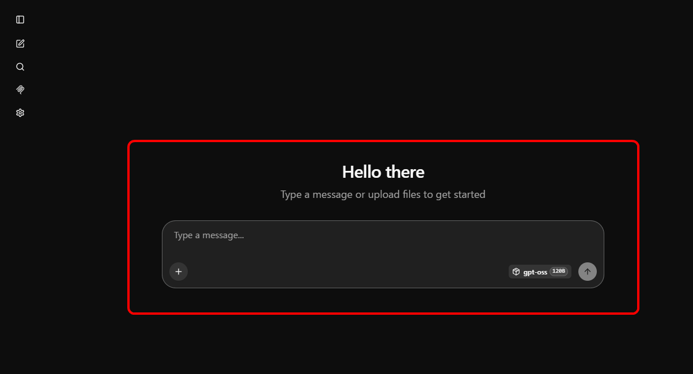
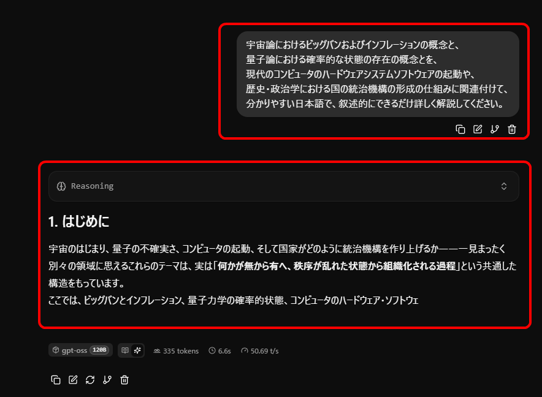
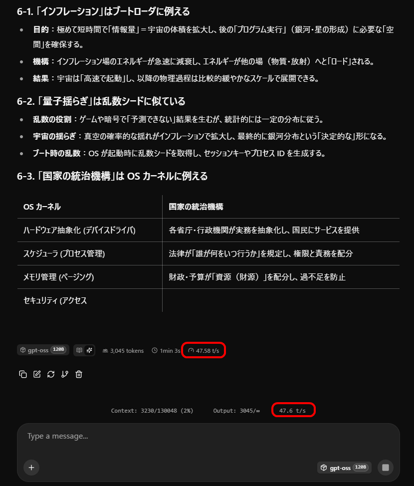
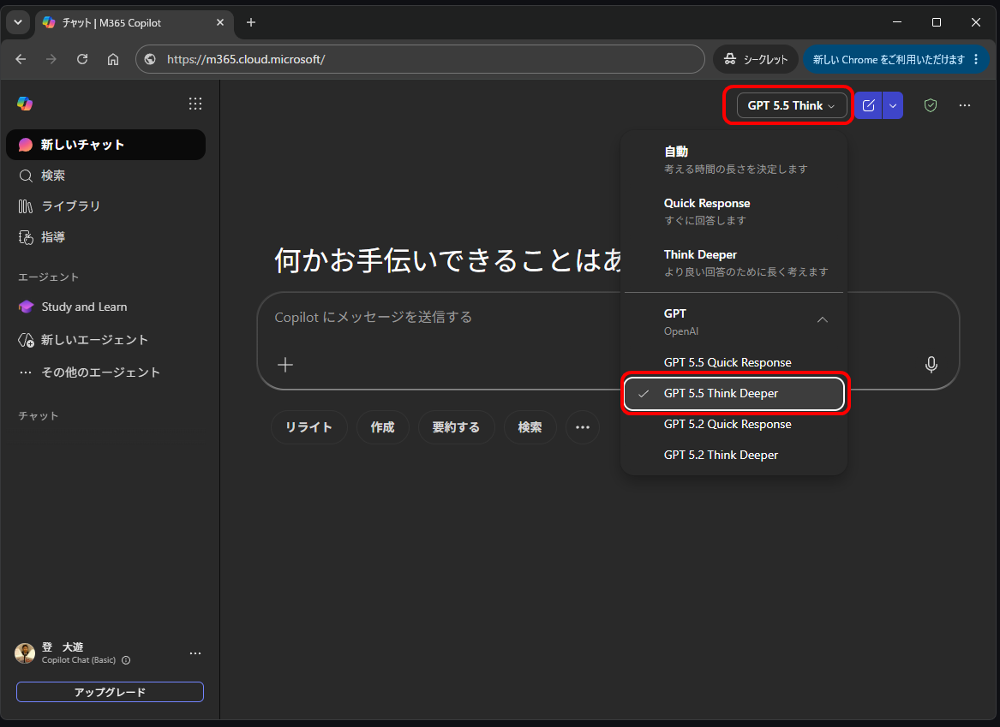
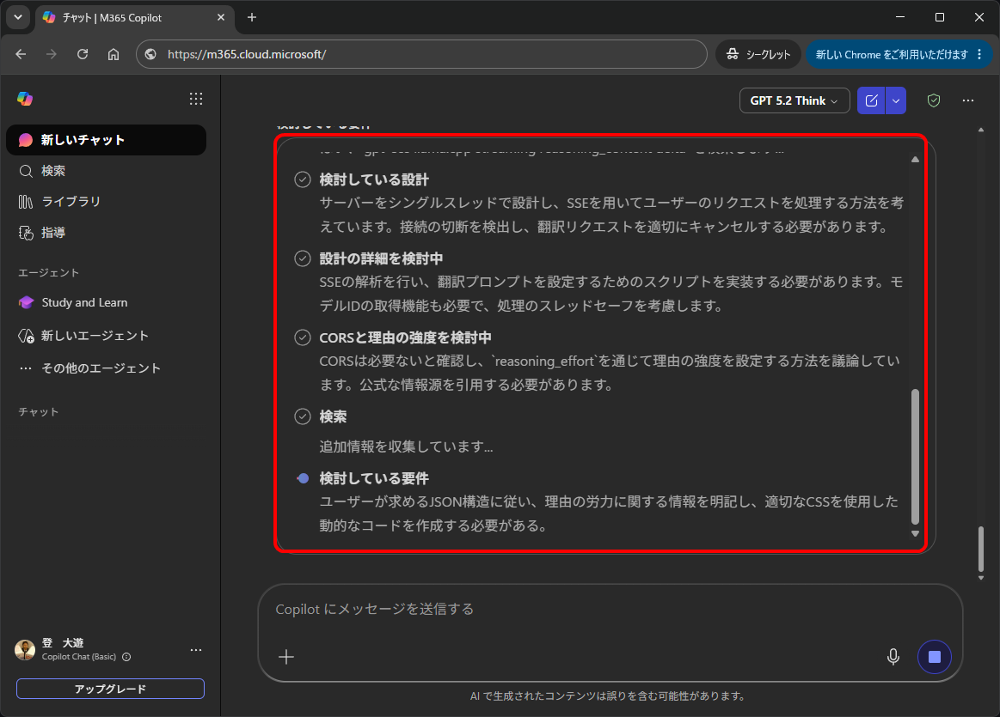
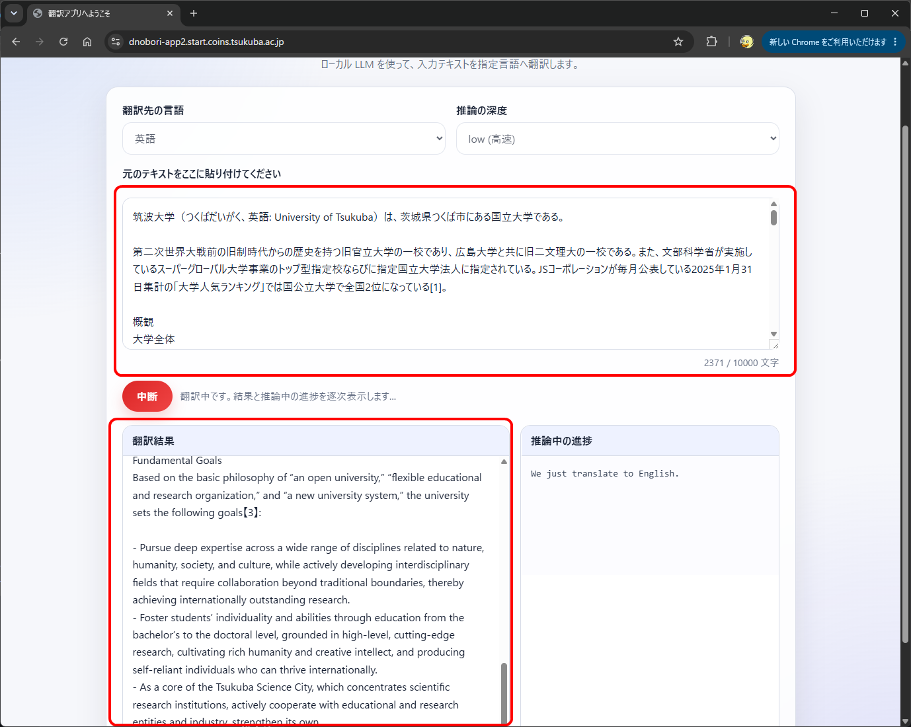

**【ステップ 5. ChatGPT 型のローカル AI を動作させてみよう】**

2026/06/22 登 初版作成

- [1. 完全にローカルで完結した AI を実現することの意義](#1-完全にローカルで完結した-ai-を実現することの意義)
- [2. OpenAI gpt-oss-120b とは](#2-openai-gpt-oss-120b-とは)
  - [2.1. OpenAI gpt-oss-120b の AI モデルのダウンロード](#21-openai-gpt-oss-120b-の-ai-モデルのダウンロード)
    - [2.1.1. 1 個目のファイルのダウンロード](#211-1-個目のファイルのダウンロード)
    - [2.1.2. 2 個目のファイルのダウンロード](#212-2-個目のファイルのダウンロード)
    - [2.1.3. 3 個目のファイルのダウンロード](#213-3-個目のファイルのダウンロード)
    - [2.1.4. ダウンロードした計 3 個のファイルの確認](#214-ダウンロードした計-3-個のファイルの確認)
- [3. AI サーバを立ち上げる前準備](#3-ai-サーバを立ち上げる前準備)
  - [3.1. Docker のインストール](#31-docker-のインストール)
- [4. AI サーバの立ち上げ](#4-ai-サーバの立ち上げ)
  - [4.1. まず、AI サーバの快適動作に必要な JSON の設定を書く](#41-まずai-サーバの快適動作に必要な-json-の設定を書く)
  - [4.2. 次に、いよいよ AI サーバを立ち上げる](#42-次にいよいよ-ai-サーバを立ち上げる)
    - [4.2.1. 【補足 1】 Docker コンテナを、「run -it」コマンドを付けて起動した場合のコンソールの処理](#421-補足-1-docker-コンテナをrun--itコマンドを付けて起動した場合のコンソールの処理)
    - [4.2.2. 【補足 2】 稼働中の Docker コンテナ一覧の確認、開始、停止、削除、ログ出力状態確認等の方法](#422-補足-2-稼働中の-docker-コンテナ一覧の確認開始停止削除ログ出力状態確認等の方法)
  - [4.3. 立ち上がった AI サーバへのアクセス](#43-立ち上がった-ai-サーバへのアクセス)
  - [4.4. AI に何か聞いてみよう](#44-ai-に何か聞いてみよう)
  - [4.5. 注意点](#45-注意点)
    - [4.5.1. 【制約事項その 1】長い入力プロンプトあるいは継続セッションでは、処理時間がかかる](#451-制約事項その-1長い入力プロンプトあるいは継続セッションでは処理時間がかかる)
    - [4.5.2. 【制約事項その 2】推論能力はかなり高いが、知識は結構乏しい](#452-制約事項その-2推論能力はかなり高いが知識は結構乏しい)
    - [4.5.3. 【制約事項その 3】安全機構が組み込まれている](#453-制約事項その-3安全機構が組み込まれている)
- [5. 自作 Python プログラムから gpt-oss-120b を呼び出してみよう](#5-自作-python-プログラムから-gpt-oss-120b-を呼び出してみよう)
  - [5.1. サンプル Python プログラム](#51-サンプル-python-プログラム)
  - [5.2. サンプル Python プログラムの書き込み](#52-サンプル-python-プログラムの書き込み)
  - [5.3. サンプル Python プログラムの実行](#53-サンプル-python-プログラムの実行)
- [6. 使いやすい Web 型の翻訳アプリを作ってみよう](#6-使いやすい-web-型の翻訳アプリを作ってみよう)
  - [6.1. Web 型翻訳アプリの開発にも AI を利用してみよう](#61-web-型翻訳アプリの開発にも-ai-を利用してみよう)
    - [6.1.1. AI を用いて翻訳アプリを作成するためのプロンプト](#611-ai-を用いて翻訳アプリを作成するためのプロンプト)
    - [6.1.2. AI を用いてプログラムを生成する際に利用できる AI](#612-ai-を用いてプログラムを生成する際に利用できる-ai)
    - [6.1.3. 実際に Microsoft Copilot 経由で翻訳アプリプログラムを作成する](#613-実際に-microsoft-copilot-経由で翻訳アプリプログラムを作成する)
  - [6.2. 作成された翻訳アプリのプログラムを実行](#62-作成された翻訳アプリのプログラムを実行)
    - [6.2.1. この翻訳アプリの仕組み](#621-この翻訳アプリの仕組み)
  - [6.3. 翻訳アプリの Python 用プログラムを Copilot を用いて作成することは安全なのか](#63-翻訳アプリの-python-用プログラムを-copilot-を用いて作成することは安全なのか)
- [7. より賢い AI を利用してみよう](#7-より賢い-ai-を利用してみよう)
  - [7.1. Qwen3.5](#71-qwen35)
    - [7.1.1. 1 個目のファイルのダウンロード](#711-1-個目のファイルのダウンロード)
    - [7.1.2. 2 個目のファイルのダウンロード](#712-2-個目のファイルのダウンロード)
    - [7.1.3. 3 個目のファイルのダウンロード](#713-3-個目のファイルのダウンロード)
    - [7.1.4. ファイルサイズの確認](#714-ファイルサイズの確認)
    - [7.1.5. ファイルのハッシュ値の確認](#715-ファイルのハッシュ値の確認)
    - [7.1.6. Qwen3.5 の実行](#716-qwen35-の実行)
    - [7.1.7. 立ち上がった Qwen3.5 AI サーバへのアクセス](#717-立ち上がった-qwen35-ai-サーバへのアクセス)
    - [7.1.8. Qwen3.5 にも安全機構が組み込まれている](#718-qwen35-にも安全機構が組み込まれている)
- [8. 安全機構を除去した AI を注意深く実行してみよう](#8-安全機構を除去した-ai-を注意深く実行してみよう)
  - [8.1. Qwen3.5 から安全機構を除去した 「Uncensored」 バージョンを注意深く実行してみよう](#81-qwen35-から安全機構を除去した-uncensored-バージョンを注意深く実行してみよう)
    - [8.1.1. 1 個目のファイルのダウンロード](#811-1-個目のファイルのダウンロード)
    - [8.1.2. 2 個目のファイルのダウンロード](#812-2-個目のファイルのダウンロード)
    - [8.1.3. ダウンロードしたファイルのサイズの確認](#813-ダウンロードしたファイルのサイズの確認)
    - [8.1.4. ファイルが破損していないかどうかの確認](#814-ファイルが破損していないかどうかの確認)
    - [8.1.5. Qwen3.5 (Uncensored) の実行](#815-qwen35-uncensored-の実行)
    - [8.1.6. 立ち上がった Qwen3.5 AI サーバ (Uncensored) へのアクセス](#816-立ち上がった-qwen35-ai-サーバ-uncensored-へのアクセス)
  - [8.2. 注意の再掲](#82-注意の再掲)
- [9. 失敗した場合](#9-失敗した場合)
- [10. 発展](#10-発展)


ここでは、Linux に root 権限で SSH でログインできることを前提とする。以下、`sudo bash` (手抜き) 状態の状態か、あるいは root ユーザで Linux にログインした状態 (さらに手抜き) を想定して、具体的手順を解説する。

# 1. 完全にローカルで完結した AI を実現することの意義
このステップでは、完全にローカルで完結した AI を実現する。

**ローカル AI は、ChatGPT 等のオンラインのクラウド型 AI サービスと異なり、AI 処理の主体が、自分自身である。AI 処理は、インターネット上のいかなるサービスにも依存することなく、手元のハードウェア上 (本講義においては、貸し出しマシン) のみで、物理的に完結する。** これにより、次の大きな利点が生じる。

1. **コストが安価である (呼出し放題)。** 何度でも AI を呼び出すことができ、呼出し回数の制限や、料金の支払が、一切不要である。たとえば、自作のいろいろなプログラムやサービスから、内部的に AI を、何回でも、呼び出すことができる。  
     
   これと対比して、たとえば ChatGPT 等のオンラインのクラウド型 AI サービスでは、呼出し回数に制限があり、API 等を経由した呼出しは、特に高額である。

2. **機密性が保障される (安心して利用可能)。** 入力プロンプトの内容は、自分自身で処理し、第三者に読み取られることがない。物理的に、自らの手元のマシンの外に出ることがない。論理的に、第三者によって決してアクセスされないように自らコントロールすることができる。これにより、プライバシや営業秘密が確実に確保される。(例外として、稼働中の AI マシンそのものに不正アクセスがなされ第三者に侵入された場合や、あるいは、AI マシンにおいてプロンプトの内容を保存していたところ、これが事後に第三者によって何らかの方法で奪取されたような場合は別である。)  
     
   これと対比として、たとえば ChatGPT 等のオンラインのクラウド型 AI サービスでは、すべてのプロンプト内容は、OpenAI 社などの AI 会社に、都度、100% 読み取られている。なぜならば、OpenAI 社などの AI 会社は、入力プロンプトの内容を読み取らなければ、AI 処理をすることができないためである。  
     
   このように、AI 処理の主体が、自分自身であることは、他者であることと比較して、機密性保持の上で、絶大なメリットがある。

3. **特定の営利主体による独自かつ不透明な善悪の価値観による制限を受けない (自己の価値観での利用、透明性の担保)。** 入力プロンプトの内容あるいは出力物に関する制約・制限は、利用しようとする AI モデルの内部に組み込まれた安全機構 (検閲的挙動を呈する機能) 以外には存在しない。そして、その安全機構は、ある程度容易に無効化することが可能である。  
      
   これと対比して、たとえば ChatGPT 等のオンラインのクラウド型 AI サービスでは、すべてのプロンプト内容あるいは出力データは、常に、OpenAI 社などの営利目的の AI 会社に監視されており、これらの AI 会社独自の善悪価値観に基づいて出力が制限されたり、あるいは、回答内容が偏向されたりしてしまい、これを避けることができない。さらには、これらの AI 会社独自の善悪価値観そのものが非公開とされており、それを外部的に公正に検証することも不能であるため、恣意的な結果の操作や使途の制限がなされるリスクが高い。そのため、重要な意思決定の局面で利用しづらい。

   ローカル AI モデルの場合、モデルデータの挙動や性質、組み込まれた安全機構を分析することもできるし、場合によっては、組み込まれた安全機構を無効化することもできるので、恣意的な結果の操作や使途の制限がなされるリスクが低く、重要な意思決定の局面で利用しやすい。

4. **挙動が不変である (安定性の実現)。** 一度 AI マシンを組み立て、AI モデルデータをダウンロードしたならば、そのモデルデータで AI を稼働させる限り、挙動は不変である。たとえば、本講義の時点 (2026 年) で、本講義の内容を用いて AI マシンを構築したとする。その手順をメモしておき、必要なモデルデータも保持しておけば、2030 年になったときも、2040 年になったときも、2026 年と全く同じ挙動で AI を動作させることができる。この動作の不変性は、たとえば、重要な業務システムにおける自作プログラムの一部に AI を組み込む場合に、極めて重要である。
    
    これと対比して、たとえば ChatGPT 等のオンラインのクラウド型 AI サービスでは、AI 会社側の技術者たちの嗜好に基づき、大小さまざまなバージョンアップが日々なされ、挙動が変化してしまう。さらに、挙動の変化のタイミングも、その内容も、コントロール不能であり、不透明である。

    自作の業務システム等のプログラムから AI を呼び出す場合を考えてみよう。たとえば、ある営業戦略ツールで、顧客ごとの性質を分析して数値化し、顧客ごとに適切なセールス戦略を計算する業務システムに AI を利用したとする。ある時のあるバージョンの ChatGPT の API を呼び出したときに、ちょうど良く動作していたのに、ChatGPT の API のバージョンが上がったり、あるいは挙動がマイナー変化してしまっただけで、そのバランスは崩れてしまう。要するに、ChatGPT 等のオンラインのクラウド型 AI サービスでは、AI 会社の技術者たちの嗜好や気まぐれによって、きわめて頻繁に、利用者側が振り回される結果となる。
    
    ローカル AI を利用する場合は、その心配がない。


# 2. OpenAI gpt-oss-120b とは
OpenAI gpt-oss-120b は、OpenAI 社が 2025 年に公開した、ローカル動作可能な LLM モデルデータである。

推論能力としては、ChatGPT 4-mini 系と同等程度の性能がある。ただ、容量の制約により、学習されている知識は比較的少ない。

## 2.1. OpenAI gpt-oss-120b の AI モデルのダウンロード
AI モデルデータは、とても大きく、ダウンロードに 10 分 ～ 1 時間程度を要する。

本講義では、予め、OpenAI gpt-oss-120b (これを本講義の AI 機材で利用しやすいように変換したもの) を、共用のダウンロード用 Web サーバに置いておいた。

具体的には、

- https://download1.start.coins.tsukuba.ac.jp/01_public/001_download1/gpt-oss-120b/250921_ggml_org_gpt_oss_120b_gguf/

という URL に置いておいた。

これを以下のようにしてダウンロードすればよい。

OpenAI gpt-oss-120b は、3 つのファイルに分かれている。次のようにして `curl` コマンドを用いてダウンロードする。

`curl` コマンドは、URL を指定して、インターネットからファイルをダウンロードするための、標準的なコマンドである。

### 2.1.1. 1 個目のファイルのダウンロード

```

curl --fail --raw --location --create-dirs --output-dir /data1/models/gpt_oss_120b/ --remote-name https://download1.start.coins.tsukuba.ac.jp/01_public/001_download1/gpt-oss-120b/250921_ggml_org_gpt_oss_120b_gguf/gpt-oss-120b-mxfp4-00001-of-00003.gguf

```

### 2.1.2. 2 個目のファイルのダウンロード

```

curl --fail --raw --location --create-dirs --output-dir /data1/models/gpt_oss_120b/ --remote-name https://download1.start.coins.tsukuba.ac.jp/01_public/001_download1/gpt-oss-120b/250921_ggml_org_gpt_oss_120b_gguf/gpt-oss-120b-mxfp4-00002-of-00003.gguf

```

### 2.1.3. 3 個目のファイルのダウンロード

```

curl --fail --raw --location --create-dirs --output-dir /data1/models/gpt_oss_120b/ --remote-name https://download1.start.coins.tsukuba.ac.jp/01_public/001_download1/gpt-oss-120b/250921_ggml_org_gpt_oss_120b_gguf/gpt-oss-120b-mxfp4-00003-of-00003.gguf

```

### 2.1.4. ダウンロードした計 3 個のファイルの確認

まず、ファイルのダウンロードが終わったか確認する。

```
ls -la /data1/models/gpt_oss_120b/
```

上記の結果、以下のように表示されればよい。

```
-rw-r--r-- 1 root root    12980384 ＜日時＞ gpt-oss-120b-mxfp4-00001-of-00003.gguf
-rw-r--r-- 1 root root 31738487200 ＜日時＞ gpt-oss-120b-mxfp4-00002-of-00003.gguf
-rw-r--r-- 1 root root 31635878880 ＜日時＞ gpt-oss-120b-mxfp4-00003-of-00003.gguf
```

次に、【ステップ 3】で示した方法と同様に、ダウンロードしたファイルが破損していないか検証する。

```
cd /data1/models/gpt_oss_120b/

sha1sum *
```

上記の結果、以下のように表示されればよい。
```
5f5f4c93f5f93b5a605e75bc7430b8b87a825655  gpt-oss-120b-mxfp4-00001-of-00003.gguf
09da0b7318abde463f2e4eed9fd0ff852b0a9910  gpt-oss-120b-mxfp4-00002-of-00003.gguf
b31b9d3b147648c1ba7de42dc4ed91d867ced913  gpt-oss-120b-mxfp4-00003-of-00003.gguf
```

# 3. AI サーバを立ち上げる前準備

## 3.1. Docker のインストール
AI サーバプログラムは、本来、自分で組み立てるべきものである。しかし、それはかなり複雑な作業である。すでに誰か第三者が組み立てて、それなりに動作する AI サーバプログラムがあれば、それをもらってきて実行することができる。

いったん組み立てられた AI サーバプログラムのようなものを、パッケージ化し、インターネット上で流通させ、容易に実行することができるようにするために利用できる仕組みとして、「コンテナ技術」というものがある。

「コンテナ技術」には、いろいろなものがあるが、近年人気があるのは「Docker」という技術である。

Docker の技術や、コンテナ技術に関する、詳しい内部的仕組みを最初に理解しようとすると、これまで述べてきたのような鶏が先か卵が先かという問題が再発し、いつまでも理解できないかも知れない。これを避けるために、本講義では、ひとまずは、「Docker」、「コンテナ」という技術が存在するという紹介に留め、実際に利用する具体的方法を以下で例示する。

まず、Docker を Linux システムにインストールする必要がある。そのためには、以下のように入力する。

```
apt-get -y update && apt-get -y install docker.io
```

特にエラーなく、Docker がインストールされたら、`docker` コマンドを実行してみる。

```
docker
```

すると、次のように、使い方の説明が表示される。

```
Usage:  docker [OPTIONS] COMMAND

A self-sufficient runtime for containers

Common Commands:
  run         Create and run a new container from an image
  exec        Execute a command in a running container
  ps          List containers
  build       Build an image from a Dockerfile
  pull        Download an image from a registry
  push        Upload an image to a registry
  images      List images
  login       Authenticate to a registry
  logout      Log out from a registry
  search      Search Docker Hub for images
  version     Show the Docker version information
  info        Display system-wide information

(... 中略 ...)

Run 'docker COMMAND --help' for more information on a command.

For more help on how to use Docker, head to https://docs.docker.com/go/guides/
```

# 4. AI サーバの立ち上げ
Docker の使い方を概念から解説し始めると、再度、理解するために鶏が先が卵が先かの問題が発生してしまう。これを避けるため、ひとまず、目当ての AI サーバの立ち上げ方法を解説する。

## 4.1. まず、AI サーバの快適動作に必要な JSON の設定を書く
これは、Docker とは本質的に無関係だが、以下のようにして、AI サーバの快適動作に必要な JSON の設定を書く。

```
mkdir -p /data1/config/common/

nano /data1/config/common/webui-config.json
```

nano テキストエディタが起動したら、以下の内容を記述して保存する。

```
{
  "showSystemMessage": true,
  "showThoughtInProgress": true,
  "disableReasoningFormat": false,
  "showMessageStats": true,
  "keepStatsVisible": true
}
```

## 4.2. 次に、いよいよ AI サーバを立ち上げる

docker コマンドを用いて、`my-llm1` という名前の新しい Docker コンテナを作成し、AI サーバを立ち上げる。以下を SSH シェルにコピー＆ペーストして貼り付け、実行するとよい。

```

docker run -it \
  --name my-llm1 \
  --network host \
  --device=/dev/kfd \
  --device=/dev/dri \
  --group-add video \
  --cap-add=SYS_PTRACE \
  --security-opt seccomp=unconfined \
  --ipc=host \
  --shm-size=32g \
  -e HIP_VISIBLE_DEVICES=0 \
  -v /data1:/data1:ro \
  docker1.start.coins.tsukuba.ac.jp/start_ghcr_io_ggml_org_llama_cpp_server_rocm_b9002:260502_ZLEU86 \
  -m "/data1/models/gpt_oss_120b/gpt-oss-120b-mxfp4-00001-of-00003.gguf" \
  --alias gpt-oss-120b \
  --host 127.0.0.1 \
  --port 7001 \
  -ngl 999 \
  -fa 1 \
  -t 16 \
  -tb 16 \
  -c 780000 \
  -np 6 \
  -b 512 \
  -ub 256 \
  --no-mmap \
  --jinja \
  --reasoning-format auto \
  --metrics \
  --webui-config-file /data1/config/common/webui-config.json

```

上記の docker コマンドの要点は、次のとおりである。上記のコマンドをよく吟味してみて、下の箇条書きの対応関係を眺めると面白い。

1. Docker コンテナ名は、`my-llm1` である。
2. Docker イメージ (インターネットからもらってくるサーバパッケージ) として、`docker1.start.coins.tsukuba.ac.jp/start_ghcr_io_ggml_org_llama_cpp_server_rocm_b9002:260502_ZLEU86` というものを利用する。(これは、著者が OSS で取得し、それをそのまま、本講義用の配信用 Docker コンテナサーバに予め置いておいたイメージである。)
3. AI モデルデータとして、`/data1/models/gpt_oss_120b/gpt-oss-120b-mxfp4-00001-of-00003.gguf` を利用する。
4. 物理的なディスク上の `/data1` というディレクトリを、Docker コンテナ内における仮想的な `/data1` ディレクトリと一対一対応させる。ただし、読み取り専用 (ro) モードでのみアクセス可能とする。
5. `127.0.0.1` (これを、ローカルホスト (localhost) という。自分自身の同一のマシン上からのみ TCP 接続できることを意味する) の TCP ポート `7001` で、AI サーバを稼働させる。インターネットからの直接アクセスは、許容しない。
6. ネットワークの仕組みは、`host` モードで動作させる。(本来は、他にもいろいろな手法があるが、今回は簡単のために host モードで動作させている。)

上記のように、`my-llm1` を立ち上げるコマンドを実行すると、数十秒かかって AI モデルデータが GPU に読み込みされる。

最後に、

```
main: server is listening on http://127.0.0.1:7001
main: starting the main loop...
srv  update_slots: all slots are idle
```

という表示が SSH 上で表示されれば OK である。

もし、この表示にならずに、起動時に何らかの不具合が発生してしまう場合は、これまでの【ステップ 1】から【ステップ 4】までで指示されている作業のうちいずれかに抜け漏れ、誤りなどがある可能性が高い。よく確かめて修正をするとよい。

おそらく 2 名のうち 1 名程度は、何らかの間違いが原因で、エラーになってしまうであろう。この場合に、その原因を究明し、問題を解決するために、インターネットを利用することができる。

- インターネット上の検索エンジンで探してみる。
- あるいは、筑波大学の学生であれば無料で使える Microsoft Copilot (Web ブラウザから、学生の Microsoft 組織アカウント `u.tsukuba.ac.jp` でログインした状態で、 https://m365.cloud.microsoft/ にアクセスすればよい) で、発生したエラーメッセージと不具合の詳細を入力し、解決策を聞いてみる。

などの方法で解決を試みるとよい。

### 4.2.1. 【補足 1】 Docker コンテナを、「run -it」コマンドを付けて起動した場合のコンソールの処理

上記のコマンド例では、`docker run -it` というコマンドで、`my-llm1` という Docker コンテナを起動している。この際、Docker コンテナが出力するいろいろなログは、このコマンドを実行した SSH の画面に表示される。

この状態では、その SSH の画面は、Docker コンテナを起動した際における画面出力に奪われてしまっている。この状態で、SSH の画面で別の操作 (例: 後述の `docker ps -a` など) を行なうためには、もう 1 個新しい SSH の接続を行なえば良い。Linux は、複数の SSH ログインを処理することができ、それぞれの SSH 操作は互いに独立している。

なお、この状態で、その操作元の SSH の画面を閉じても、その Docker コンテナは起動したままの状態になっている。この状態で `Ctrl + C` を押すと、Docker コンテナの内部のプログラムに終了信号が発せられ、Docker コンテナが終了してしまうので、注意すること。終了してしまった場合は、後述の `docker start` コマンドで再起動することができる。


### 4.2.2. 【補足 2】 稼働中の Docker コンテナ一覧の確認、開始、停止、削除、ログ出力状態確認等の方法

稼働中の Docker コンテナ一覧の確認には、次のコマンドを利用する。Docker コンテナの一覧とともに、それぞれの Docker コンテナが稼働中か、停止中かといった状態が表示される。

```
docker ps -a
```

稼働中の特定の Docker コンテナの停止をするためには、次のコマンドを利用する。

```
docker stop ＜コンテナ名＞
```

停止中の特定の Docker コンテナを開始するためには、次のコマンドを利用する。

```
docker start ＜コンテナ名＞
```

すでに作成されている Docker コンテナを削除するためには、次のコマンドを利用する。`-f` オプションを付けると、現在稼働中のコンテナを停止させ、削除することが可能である。

```
docker rm -f ＜コンテナ名＞
```

Docker コンテナは、簡単に、開始・停止・削除・再作成することが可能である。再作成には、上述の `docker run` コマンドを利用する。いったん作成した Docker コンテナの作成時の設定をいろいろ編集したくなったら、一度、`docker rm -f` コマンドでその Docker コンテナを削除してから、`docker run` コマンドで再作成すればよい。

前述の `docker run -it` コマンドは、結構特別なコマンドである。起動時において、Docker 内のプログラムによってずらずらと表示されるメッセージがすべて表示される。

一度起動した Docker イメージの出力しているメッセージを、前述の `docker run -it` コマンドを実行した SSH 画面とは別の画面から表示するには、次のようにする。

```
docker logs ＜コンテナ名＞
```

ただし、上記の `docker logs` コマンドは、現在溜まっている表示メッセージを一挙に表示した上で、すぐに終了してしまう。前述の `docker run -it` コマンドと同様に、リアルタイムで、生成されるメッセージを表示したいならば、

```
docker logs -f ＜コンテナ名＞
```

と入力すればよい。

あるいは、前述の `docker run -it` コマンドと同様に、単に結果を表示するだけでなく、Docker 内部で動作しているプログラムに何らかの `Ctrl + C` などのキーボード入力を伝達したい場合は、

```
docker attach ＜コンテナ名＞
```

と入力すればよい。

上記のような docker の各基本コマンドは、無理に覚えようとする必要はない。本講義のサーバを利用している間に、いろいろとトラブルが発生するであろうから (たとえば、`my-llm1` という Docker コンテナが稼働しているときに、後述の `my-llm2` という Docker コンテナを立ち上げようとすると、エラーが発生してしまう。その状態から、正常な状態に復帰するという試行錯誤に際して、必ず、上記のような docker コマンドを、自らの判断で多用することになる)、その際に覚えればよい。

再掲であるが、Docker の使い方にまつわる操作ミスで生じる不具合を解決するために、インターネットを利用することができる。

- インターネット上の検索エンジンで探してみる。
- あるいは、筑波大学の学生であれば無料で使える Microsoft Copilot (Web ブラウザから、学生の Microsoft 組織アカウント `u.tsukuba.ac.jp` でログインした状態で、 https://m365.cloud.microsoft/ にアクセスすればよい) で、発生したエラーメッセージと不具合の詳細を入力し、解決策を聞いてみる。

などの方法で解決を試みるとよい。


## 4.3. 立ち上がった AI サーバへのアクセス

上述の `docker run -it --name my-llm1 (以下略)` のコマンドで立ち上がった AI サーバにアクセスしてみよう。

```
https://◎-app1.start.coins.tsukuba.ac.jp/
```

(上記の ◎ の部分は、【ステップ 1】で決めたハンドルネームである) にアクセスする。すると、【ステップ 4】で自ら設定した Basic 認証のユーザー名とパスワードを聞かれるので (なお、ステップ 4 ですでに Basic 認証のユーザー名とパスワードを聞かれた Web ブラウザを起動したままで再度アクセスする場合は、省略される場合があり、その場合は、聞かれない)、正しく指定する。

うまくいけば、Web ブラウザ上に、次のプロンプトが表示されるであろう。



## 4.4. AI に何か聞いてみよう

上記の `Type a message...` と表示されている部分に、AI に聞きたいメッセージを入力する。

日本語でも、英語でも、何でもよい。たとえば、

```

宇宙論におけるビッグバンおよびインフレーションの概念と、
量子論における確率的な状態の存在の概念とを、
現代のコンピュータのハードウェアシステムソフトウェアの起動や、
歴史・政治学における国の統治機構の形成の仕組みに関連付けて、
分かりやすい日本語で、叙述的にできるだけ詳しく解説してください。


```

と入力してみよう。

すると、数秒程度 AI が推論をし、以下のスクリーンショットのように、結果の応答を開始する。




ここで、結果の応答中には、下図の赤枠の `46.95 t/s` のように、毎秒何トークンが出力されているか、その速度の概算が表示される。おそらく、受講生の方々にお貸ししているマシンの GPU だと、40 ～ 50 トークン毎秒が出力されるであろう。これは、かなり高速な部類であり、少し前の (ChatGPT 3.5 ～ 4 世代の) 市販のクラウド型のオンライン AI サービスに一応匹敵する速度である。




## 4.5. 注意点
gpt-oss-120b では、以下のような制約が存在する。

### 4.5.1. 【制約事項その 1】長い入力プロンプトあるいは継続セッションでは、処理時間がかかる
貸し出しマシンの GPU は、それなりに高速に動作するように見えるが、GPU 内のプロセッサの速度は実はそれほど速くない。

- とても長い入力プロンプトの投入
- ある 1 つのチャットセッションの継続セッション (追加の質問) の投入

を行なった場合、プロンプト内容の処理に結構な時間がかかる可能性がある。

特に、ある 1 つのチャットセッションの継続セッション (追加の質問) の投入を繰り返すと、だんだんと速度が遅くなる。

**そこで、できるだけ、ある 1 つのチャットセッションの継続セッション (追加の質問) の投入をすることなく、毎回、新規チャットを開始して、新たなセッションで質問をすることを推奨する。**

### 4.5.2. 【制約事項その 2】推論能力はかなり高いが、知識は結構乏しい
gpt-oss-120b は、サイズの制約上、推論能力はかなり高いが、知識は結構乏しい。わずか 60GB 程度のモデルデータ内に格納されているデータに基づき回答しており、かつ、回答においては、インターネット上の知識を一切確認することなく、自らの知識のみに基づいて回答しているためである。

たとえば、

```

筑波大学の学科・学部を列挙してください。

```
というプロンプトを入れると、もっともらしい答えが返ってくるが、細部が結構間違っている。このような間違いを、AI における「ハルシネーション」という。

### 4.5.3. 【制約事項その 3】安全機構が組み込まれている
gpt-oss-120b には、OpenAI 社による安全機構が組み込まれており、同社の価値観に基づく「危険」な質問には回答しないなどの検閲的挙動を呈する。

- **実際に、何らかの危険性のあるプロンプトを入力してみよう。そして、AI がどのような反応を示すか、観察してみよう。**


# 5. 自作 Python プログラムから gpt-oss-120b を呼び出してみよう

上述の手順では、Web ブラウザ経由のチャット画面で gpt-oss-120b を呼び出していた。これは、人間が AI を利用する際に便利である。

他方で、自作のプログラムの挙動・処理の一部として、AI に何らかの処理をさせ (自作プログラムで作成した入力プロンプト文字列の送付)、その結果の応答文字列を受け取って、自作プログラムの挙動の結果としてその応答結果を用いる、ということができれば、仕事上とても有益である。何回呼び出してもコストがかからないという点は、ChatGPT 等の商用オンライン型 AI を大きく凌駕する、ローカル AI のメリットである。

そこで、自作 Python プログラムから、現在動作している `my_llm1` Docker コンテナの AI エンジンを呼び出して、AI 処理をさせてみよう。

## 5.1. サンプル Python プログラム
以下に、自作 Python プログラムから gpt-oss-120b を呼び出すためのサンプルコードを示す。

```
#!/usr/bin/env python3
# -*- coding: utf-8 -*-

"""
ai_call.py

localhost:7001 の OpenAI ChatGPT 互換 API に文字列を送信し、
ストリーミング応答をコンソールへ逐次表示しつつ、
最終的な応答文字列を戻す学習用サンプル。

設計 2026/6/21 登, コーディング: ChatGPT 5.5 Instant
"""

import http.client
import json
import socket
import sys
import time


class TCPNoDelayHTTPConnection(http.client.HTTPConnection):
    """HTTP 接続時に TCP_NODELAY を有効化し、Nagle を OFF にする接続クラス。"""

    def connect(self):
        """TCP 接続を作成し、接続後に通信タイムアウトと TCP_NODELAY を設定する。"""
        super().connect()
        self.sock.setsockopt(socket.IPPROTO_TCP, socket.TCP_NODELAY, 1)
        self.sock.settimeout(60)


def ai_call(prompt: str) -> str:
    """
    AI に prompt を送信し、応答文字列を返す。

    引数:
        prompt: AI に入力する文字列。

    戻り値:
        AI の応答全文。
    """

    body = {
        "model": "gpt-oss-120b",
        "messages": [
            {"role": "user", "content": prompt}
        ],
        "stream": True,

        # Custom JSON [01]
        # gpt-oss-120b / llama.cpp 側のチャットテンプレートへ渡す推論レベル指定。
        "chat_template_kwargs": {
            "reasoning_effort": "low"
        }
    }

    conn = TCPNoDelayHTTPConnection("127.0.0.1", 7001, timeout=10)

    conn.request(
        "POST",
        "/v1/chat/completions",
        body=json.dumps(body).encode("utf-8"),
        headers={
            "Content-Type": "application/json",
            "Accept": "text/event-stream",
            "Connection": "close",
        },
    )

    res = conn.getresponse()

    if res.status < 200 or res.status >= 300:
        raise RuntimeError(f"HTTP error: {res.status} {res.reason}\n{res.read().decode('utf-8', 'replace')}")

    result = []
    line = b""

    while True:
        b = res.read(1)
        if not b:
            break

        if b == b"\n":
            s = line.decode("utf-8", "replace").strip()
            line = b""

            if not s.startswith("data:"):
                continue

            data = s[5:].strip()
            if data == "[DONE]":
                break

            obj = json.loads(data)
            delta = obj.get("choices", [{}])[0].get("delta", {})
            text = delta.get("content")

            if text:
                print(text, end="", flush=True)
                result.append(text)

        elif b != b"\r":
            line += b

    conn.close()
    return "".join(result)


if __name__ == "__main__":
    input_text = " ".join(sys.argv[1:]).strip()

    if not input_text:
        print("引数として AI に聞きたい事柄を指定してください。")
        sys.exit(1)

    print(f"AI 入力プロンプト「{input_text}」")

    start = time.time()
    answer = ai_call(input_text)
    elapsed = time.time() - start

    print()
    print(f"AI 応答結果 (経過時間: {elapsed:.1f} 秒) 「{answer}」")
```

上記のプログラムのうち、`ai_call` 関数は、引数として、ローカルで動作するローカル AI に入力したいプロンプト文字列をとる。そして、`ai_call` 関数は AI を呼出し、その結果を、関数の戻り値として文字列で返す。(このサンプルプログラムでは、わかりやすくするために、AI の応答文字列を、届いたものからいちはやく、順に 1 文字ずつ描画する工夫も行なっているが、これは、自作のアプリケーション等から呼び出す際は不要だから、削除してもよい。)

## 5.2. サンプル Python プログラムの書き込み
上記のサンプル Python プログラムは、SSH でローカル AI サーバにログインした状態で、どこでも良いので、以下のように書き込むとよい。

```
nano aitest.py
```

nano テキストエディタが開いたら、上記の Python サンプルコードをコピー＆ペーストで貼り付けて、`aitest.py` として上書き保存する。

## 5.3. サンプル Python プログラムの実行

```
python3 aitest.py 
```

を実行すると、

```
引数として AI に聞きたい事柄を指定してください。
```

というエラーが表示される。そこで、`python3 aitest.py` に続けて、1 文字スペースを入れ、さらに、

- **「顧客Aの購入履歴: パソコン1台。Aの不満:「最近、パソコンの起動が遅い。」Aに勧めるべき周辺機器を優先度の高い順にJSONリストで列挙し、購入確率と、理由とともに提示。」**

という入力プロンプトをつなげて `aitest.py` を起動してみよう。

すると、たとえば、次のような応答結果が表示される。

```json
[
  {
    "product": "外付けNVMe SSD（USB 3.2 Gen 2 接続）",
    "purchase_probability": 0.78,
    "reason": "起動遅延の最大要因はストレージの読み書き速度です。外付け NVMe SSD を OS 起動ディスクとして使用すれば、内部 HDD/旧型 SSD に比べて 3‑5 倍速い起動が可能。USB3.2 Gen2 の高速インターフェースでほぼ内部 SSD と同等の体感速度を提供でき、内部改造が難しいノートでも簡単に導入できる点が購買意欲を高めます。"
  },
  {
    "product": "メモリ増設キット（8GB DDR4 3200MHz）",
    "purchase_probability": 0.65,
    "reason": "起動時に多数のバックグラウンドプロセスがメモリを圧迫すると、ディスクスワップが頻発し起動が遅くなります。8GB 追加で合計 12‑16GB にすれば、スワップ発生率が大幅に低減し、OS の起動とアプリ起動がスムーズに。ノートパソコンの多くはメモリスロットが2つあるため、増設が比較的容易です。"
  },
  {
    "product": "ラップトップ用クーリングパッド（USB給電・ファン4個）",
    "purchase_probability": 0.48,
    "reason": "CPU と SSD が熱くなるとサーマルスロットリングが起き、結果的に起動が遅くなるケースがあります。クーリングパッドはノート本体の熱を外部に放散し、サーマルスロットリングを抑制。特に夏場や高負荷時の起動速度改善に寄与するため、熱問題を懸念するユーザーに訴求しやすい。"
  },
  {
    "product": "OS クリーンインストール用 USB インストールメディア（Windows 11）＋バックアップソフト",
    "purchase_probability": 0.32,
    "reason": "ハードウェア的な改善が難しい場合、ソフトウェア側の最適化が有効です。クリーンインストールは不要なサービスやレジストリの肥大化を一掃し、起動時間を 30‑40% 短縮できることが多い。バックアップソフトとセットで提供すれば、データ保護への不安も解消でき、購入ハードルが下がります。"
  },
  {
    "product": "USB-C ドックステーション（HDMI、DisplayPort、Ethernet、USB3.1 ポート）",
    "purchase_probability": 0.20,
    "reason": "起動速度そのものへの直接的効果は低いが、作業環境の拡張で「ノートパソコンの性能不足感」を緩和できる。外部ディスプレイや有線 LAN による快適な作業環境が提供できれば、全体的な満足度が向上し、結果的に再購入や上位機種へのアップセルにつながりやすい。"
  }
]
```

ここで重要なことは、応答文字列は、このサンプル Python プログラムの main 部分における 

```
answer = ai_call(input_text)
```

という `ai_call` 関数呼出処理により、`answer` という単なる文字列変数に格納される、という点である。そして、`input_text` も単なる文字列変数である。このように、文字列変数を指定すると、それが AI 処理され、文字列変数として結果が戻ってくるという、あたかも自作のプログラム内での普通の関数呼出しのような形で、ローカル AI を呼び出すことが可能である。

上記のテクニックにより、任意の業務用アプリケーションや営業ツール等で、AI を内部的に呼び出して、その結果を利用できる。たとえば、上記のプロンプトの例では、顧客 A の過去の購入履歴と、顧客 A からコンタクトセンターが聴き取ったメッセージをもとに、顧客 A に対してお勧めすべき製品の優先順位を、お勧め理由文字列とともに、JSON のリスト構造で AI に生成させている。この結果の JSON データを、呼出し元自作プログラムで処理した上で、顧客 A に対するダイレクトメール、あるいは顧客 A が次回自社の通販サイトにアクセスした際にトップページに表示される製品として、理由とともに提示することができる。

# 6. 使いやすい Web 型の翻訳アプリを作ってみよう
上記の Python サンプルプログラムは、SSH のコマンドラインの引数として、AI 処理をプログラムから呼び出すというものであった。

この原理を応用すれば、自作の Web サービスから AI を呼び出すことも可能である。

たとえば、受講者の方々は、「Google 翻訳」のような Web 型翻訳システムを利用されたことがあると考えられる。今回作成した AI マシンを用いれば、「Google 翻訳」のような Web 型翻訳アプリを独自に作成し、これを、Google 翻訳のようなクラウドサービスに依存することなく、完全に、自分のマシン内で完結して動作させることが可能である。

## 6.1. Web 型翻訳アプリの開発にも AI を利用してみよう
本来であれば、Web 型翻訳アプリの作成には、プログラミング (HTML, Python, JavaScript) の知識が必要である。翻訳中の文章をできるだけ高速にリアルタイムで表示するといった、より快適な翻訳アプリを作るためには、それらの深い知識が必要である。だが、そのようなプログラミングの勉強には数年間かかり、人によっては、習得困難な場合も多い。

近年、プログラミングの知識や経験が少なくとも、ある程度正しい設計を入力すれば、AI を用いてプログラムを自動生成することが可能となった。

そこで、Web 型翻訳アプリの開発に AI を利用してみよう。

### 6.1.1. AI を用いて翻訳アプリを作成するためのプロンプト

AI を用いて翻訳アプリを作成するためには、日本語などの慣れた言語で、設計を記述する必要がある。

たとえば、次のような設計文を書いてみる。

```
以下の Python プログラムを作成せよ。

1. 環境
(1) Ubuntu 24.04 x64 の標準的環境で、Python 3.12 がインストールされている。
(2) localhost (127.0.0.1) の TCP ポート 7001 で、ローカル LLM が動作して
いる。これは、OpenAI ChatGPT 互換 API として、 http://127.0.0.1:7001/v1/chat/completions
 というエンドポイントでリクエストを待ち受けている。(この中身は gpt-oss-120b
であり、ghcr.io/ggml-org/llama.cpp:server-rocm によって動作してい
る。)
(3) (2) に接続する際、localhost (127.0.0.1) からであれば、HTTP ヘッダによ
る認証は不要である。

2. 作りたい Web アプリ
以下の仕様を満たす翻訳アプリを作りたい。(2) の LLM を呼び出して翻訳するも
のである。
(11) 「1.」の環境で、(1) の python を用いて動作する Web アプリ。TCP ポー
ト 7002 で 127.0.0.1 に対して bind/listen するもの。
すなわち http://127.0.0.1:7002/
 として動作させ、別途ローカルマシンで稼働させる nginx を経由して、LAN 上
の他の PC から接続可能にしたい。
(12) 当該 Web アプリは、軽量なシングル HTML ページであり、JavaScript を用
いて、python のサーバー機能と通信する。
(13) 当該 Web アプリの画面 (/) は、日本語とし、画面デザインの詳細は、次の
とおりである。
    (a) 「翻訳アプリへようこそ」というタイトル文字が上のほうにある。
    (b) 「翻訳先の言語」として、「英語」、「日本語」、「中国語」、「イタ
リア語」、「フランス語」、「ロシア語」、「ドイツ語」が選択可能である。
    (c) (b) の下に、「元のテキストをここに貼り付けてください」というテキ
ストボックスがある。これは改行が可能である。テキストボックスは最大 10000 
文字まで入力できる。
    (d) (c) の下に、「翻訳の実行」というボタンがある。
    (e) (d) の下に、「翻訳結果」および「推論中の進捗」が表示されるべきプ
レースホルダがある。ここは、最初は空っぽである。
    (f) / という 1 枚のページの内容は、python スクリプト上に埋め込まれて
いるべきである。この / の HTML 内に JavaScript などがすべて書かれている。
なお、CDN を用いて、既存の javascipt ライブラリや、かっこいい現代風の 
CSS ライブラリなどを読み込んでもよい。

    (g) (d) のボタンの上に、「推論の深度」というドロップダウンリストを付
け、「low (高速)」、「medium (標準)」、「high (深い)」の 3 段階から選択で
きるようにする。デフォルトは「medium (標準)」とする。それぞれを選択すると、
(2) に対して Custom JSON (詳細は、 gpt-oss-120b の推論レベルの設定方法を
インターネットをリサーチして参照せよ) として [01], [02], [03] の設定が指
定されるものとする。

    (h) ページのロード時に、(b) および (g) のドロップダウンリストの選択は、
最後に「翻訳」を実行した際の選択がブラウザに保存されていて、それがデフォ
ルト値として選択されること。ただし、始めての場合は、(b) は「英語」、(g) 
は low とすること。

--- [01] ここから ---
{
  "chat_template_kwargs": {
    "reasoning_effort": "low"
  }
}
--- [01] ここまで ---


--- [02] ここから ---
{
  "chat_template_kwargs": {
    "reasoning_effort": "medium"
  }
}
--- [02] ここまで ---


--- [03] ここから ---
{
  "chat_template_kwargs": {
    "reasoning_effort": "high"
  }
}
--- [03] ここまで ---


(14) ユーザーは、(c) に任意の文字列を入力し、(d) のボタンをクリックすると、
python のサーバー機能に (c) の文字と (b) の言語が送付される。
        - python のサーバー機能は、その内容をもとに、(2) に渡す翻訳依頼プ
ロンプトを組み立て、(2) に送信する。
        - Web 画面は、翻訳中かどうかのステータスを表示するとともに、推論
中および出力中は、リアルタイムでできるだけ 1 文字ずつあるいは最小単位ずつ 
(e) の「翻訳結果」に増分表示する。また、(2) における推論中のリアルタイム
の思考プロセスや思考ステータスは、(e) の「推論中の進捗」に表示し、ユーザ
の退屈を防止する。
        - ユーザが web 画面を処理中に閉じてしまったら、python のサーバ機
能は、そのことをキャンセルし、(2) に対する HTTP リクエストを切断する。こ
れにより (2) の GPU リソースはできるだけ早期に開放され、無駄なことがなく
なる。・・・ ①
        - 翻訳中は、(d) のボタンは「中断」という名前に変わる。「中断」を
押すと、① とほとんど同様の操作となり、翻訳処理は中断され、(d) の表示に戻
る。
        - 翻訳中は、(2) におけるリアルタイムの思考プロセスや思考ステータ
スは、(e) の「推論中の進捗」に表示し、ユーザの退屈を防止する。推論内容そ
のものも表示する (ユーザは管理者と同一人であり、セキュリティ上の懸念はな
いものとする)。
        - 翻訳中は、出来上がった翻訳結果の文章の一部分でも、リアルタイム
でできるだけ 1 文字ずつあるいは最小単位ずつ (e) の「翻訳結果」に増分表示
する。
        - 翻訳がすべて完了したら、翻訳結果の文章が (e) に表示される。

3. タスク
上記の「2.」のアプリを実現する python3 スクリプト 1 個を作成せよ。でき
るだけシンプルなものにし、外部ライブラリ依存は最小とし、(1) の python3 に
標準付属しているもののみ利用せよ。

【AI指示】スケルトンでなく無エラー完全動作コード生成。できるだけ詳しく日
本語コメントを付けよ。関数・引数・戻値、データ構造もコメント。

```

### 6.1.2. AI を用いてプログラムを生成する際に利用できる AI

本講義の受講者が、AI を用いてプログラムを生成する際に利用できる AI としては、以下の 2 種類がある。

1. **先ほど作成した gpt-oss-120b の AI そのものを用いる。**  
   gpt-oss-120b は、結構高い推論能力を有しているので、AI を用いてプログラムを生成する際に利用できる AI として利用できることがある。ただし、プログラムの規模が少し大きくなると、間違いが増えてしまい、修正するために、人間にプログラミングの知識が必要となる。

2. **筑波大学が全学で契約している Microsoft 365 の Microsoft Copilot 経由で ChatGPT 5.5 Thinking を呼び出す。**  
   筑波大学の学生であれば無料で使える Microsoft Copilot (Web ブラウザから、学生の Microsoft 組織アカウント `u.tsukuba.ac.jp` でログインした状態で、 https://m365.cloud.microsoft/ にアクセスすればよい) を利用する。

上記「1.」と「2.」のいずれを利用してもよいが、「1.」は上述のとおり何度かの試行錯誤を要する。初心者は「2.」の Microsoft Copilot 経由で ChatGPT 5.5 Thinking を呼び出す手法を用いるとよい。

### 6.1.3. 実際に Microsoft Copilot 経由で翻訳アプリプログラムを作成する

https://m365.cloud.microsoft/ にアクセスして、学生の Microsoft 組織アカウント `u.tsukuba.ac.jp` でログインする。(**Sign-in** または **サインイン** などのボタンをクリックして、組織アカウント `u.tsukuba.ac.jp` でログインする必要がある。)

すると、下図のように、Copilot の画面が表示される。ここで、画面右上に、AI モデルを選択することができるボタンがある。これをクリックし、下図のように、`GPT 5.5 Think Deeper` を選択する。



その上で、上記の Python プログラム作成指示プロンプト (設計書) を、プロンプト入力画面にコピー＆ペーストしてみる。もちろん、内容を好みに応じていろいろ変更してもよい。

Copilot 経由の ChatGPT 5.5 Thinking による AI によるプログラム作成には、数分間かかる。以下のように、思考中の様子は、画面上にリアルタイムで表示される (折りたたまれている場合があるが、クリックすると表示される)。



AI がプログラムを全部作成完了するまでは、数分間かかるが、途中までのプログラムを表示するには「その他の行を表示する」ボタンを押すとよい。

本文書執筆時点で、Copilot の Web 画面は、あまり洗練されておらず、未だプログラムの作成中なのか、作成が終わったのか、はっきり分からない場合がある。作成中あるいは作成されたプログラムコードを一番下までスクロールしてみて、完成したか否かを判断するとよい。

また、いろいろとバグがあるようで、途中で「申し訳ございません。処理が中断されました。」と表示されることもある。このような場合、何度か再試行する必要がある。

うまくいけば、1,000 ～ 2,000 行程度の Python 用のプログラムコードが生成されるはずである。

## 6.2. 作成された翻訳アプリのプログラムを実行

Copilot によって作成された Python プログラムを、サーバ上にファイルとして保存し、これを実行してみよう。

SSH 画面を開き、Copilot によって作成された Python プログラムを、ホームディレクトリ上で `my_translate_app.py` として保存したとする。  
(保存する方法は、これまで何度も出てきたテキストエディタである nano を利用する方法でもよいし、その他いろいろな方法がある。なお、大量のテキストを nano にコピー＆ペーストで一気に貼り付けると、バッファリングという仕組みの都合で、テキストが欠ける可能性があるので、注意を要する。いろいろな対策方法がある。このようなトラブルに遭遇した際に、自ら原因を推定し、知識をインターネットで調べ、問題を解決することが重要である。)

これを
```
python3 my_translate_app.py
```
として SSH 上で実行する。  
(なお、プログラムを終了するには、Ctrl + C を押すとよい。Linux 上のプログラムは、たいてい、Ctrl + C を押すと、終了する。)

この状態で、my_translate_app.py というプログラムは、TCP ポート 7002 で稼働している。【ステップ 4】で解説した、nginx の「サンプル振り分けルール」が、ここで価値を発揮する。

手元の PC やスマートフォン等の Web ブラウザから、

```
https://◎-app2.start.coins.tsukuba.ac.jp/
```

にアクセスしてみる (上記の ◎ の部分は、【ステップ 1】で決めたハンドルネームである)。すると、【ステップ 4】で自ら設定した Basic 認証のユーザー名とパスワードを聞かれるので (なお、ステップ 4 ですでに Basic 認証のユーザー名とパスワードを聞かれた Web ブラウザを起動したままで再度アクセスする場合は、省略される場合があり、その場合は、聞かれない)、正しく指定する。

うまくいけば、下図のように、翻訳アプリの画面が表示されるはずである。この翻訳アプリは、まさに、先ほどあなた (受講者) の指示に基づいて、Copilot によって作成された Python プログラムが実現しているものである。AI が毎回一から作成するコードであるため、実際に実行した結果の画面デザインは、下図と大きく異なる可能性がある。



ここで、翻訳先言語を選択した上で、適当な入力テキストをコピー＆ペーストし、翻訳をしてみるとよい。たとえば、[筑波大学の Wikipedia の解説文](https://ja.wikipedia.org/wiki/%E7%AD%91%E6%B3%A2%E5%A4%A7%E5%AD%A6) などを適当にコピー＆ペーストして「翻訳の実行」ボタンを押すと、リアルタイムで、翻訳が実施され、結果が表示される。

この翻訳 Web アプリと、その Web アプリが内部的に呼び出している AI エンジンは、すべて、受講者の手元のマシン上で完結して動作している。インターネット上のサービスは、一際、呼び出していない。翻訳しようとする入力元テキストデータの内容や、翻訳結果などが、米国や中国などの外国クラウド会社に送付されることはない。

### 6.2.1. この翻訳アプリの仕組み
先ほどの設計指示メッセージにあるように、この翻訳アプリの実施していることは、かなり単純である。ユーザに対して HTML で翻訳画面を表示し、ユーザが翻訳したい文章を入力して実行ボタンを押すと、ユーザが入力した文章とともに、「以下の内容を ○○ 語に翻訳せよ」という指示を gpt-oss-120b に送付する。そして、その出力結果を、リアルタイムにユーザ画面に表示する。

## 6.3. 翻訳アプリの Python 用プログラムを Copilot を用いて作成することは安全なのか

折角のローカル AI の作り方に係る講義であるのに、そのローカル AI を呼び出すプログラムのサンプルとしての翻訳アプリの作成に、Microsoft の Copilot を用いることが、矛盾しているのではないか? という感想を持たれる方もいらっしゃるかも知れない。

たしかに、Microsoft の Copilot を用いて、AI によるプログラム作成を実行する行為は、そのプログラムを作成するという部分だけみると、外部依存である。しかし、重要な点として、これによって得られたプログラムは手元に取得でき、完全な自己コントロール下に置くことができる点がある。そして、作られたプログラムは何度呼び出してもコストはかからないし、プログラムで機密のデータを処理しても、データが外部に送付されることはない (バックドアのようなものが埋め込みされていない限り。ただ、これは、本件のような小規模なプログラムであれば、容易に発見できるから、問題は少ない)。さらに、作られたプログラムには完全な透明性があり (ソースコードそのものが読めるため)、加えて、何年経過しても、挙動が勝手に変化することはない。

このように考えると、 **Microsoft の Copilot や、OpenAI の ChatGPT (Codex)、Anthropic の Claude Code 等の外部依存 AI を用いて、外部依存性のないプログラムを作成してもらうことは、コスト、機密性、透明性、安定性 (挙動不変性) の観点から、かなり安全である (外部依存性による不利益がほとんど生じない)** ということができる。

近年、世間で言われる、「AI を用いたソフトウェア開発」には 2 通りの方法があるようである。以下の 2 通りを区別することが重要である。

1. 外部の AI サービスの API 等を、自作のプログラムから都度呼び出す。
2. 外部の AI サービスを用いて、自作のプログラムをコーディングしてもらう。

上記のうち、「1.」は、これまで述べたとおり、コスト、機密性、透明性、安定性 (挙動不変性) の観点から、かなりのリスクがある。

他方で、「2.」は、これらの問題は極めて少なく、一度作成してもらったプログラムは、永久に自らの資産として活用することができる。

そして、「2.」で作成してもらうプログラムでは、作成時において、自ら構築するローカル AI サーバを呼び出すように指示することが可能である。実際に、上記の翻訳アプリの作成作業では、そのとおりのことを行なって、うまく動作している。

ローカル AI が高速・低コスト・実用的になるに従って、ソフトウェア開発の現場では「2.」の手法と、当該手法で作成するプログラムの内部的呼出し先としてローカル AI を活用する手法が一般的となると考えられる。本講義のここまでの内容で、その手法を実現するための基本的パターンを習得いただければ幸いである。

# 7. より賢い AI を利用してみよう
## 7.1. Qwen3.5
上記の gpt-oss-120b は 2025 年 8 月に OpenAI 社によって公開されたものであり、性能はそれなりに高い。それより後の 2026 年 2 月に、「Qwen3.5」というモデルが Alibaba Cloud 社によって公開された。Qwen3.5 は、gpt-oss-120b よりもさらに賢いモデルであるようである。

本講義用のダウンロードサーバには、Qwen3.5 を本講義で利用するマシンの GPU でロードできるサイズに量子化 (圧縮) したモデルがある。

もし、Qwen3.5 を利用してみたいならば、次の方法でモデルファイルダウンロードして、実行できる。

### 7.1.1. 1 個目のファイルのダウンロード

```

curl --fail --raw --location --create-dirs --output-dir /data1/models/qwen_3.5-122b-normal/ --remote-name https://download1.start.coins.tsukuba.ac.jp/01_public/001_download1/qwen3.5-122b/260503_unsloth_qwen3_5_122b_a10b_gguf_resolve_main_ud_q4_k_xl/Qwen3.5-122B-A10B-UD-Q4_K_XL-00001-of-00003.gguf

```

### 7.1.2. 2 個目のファイルのダウンロード

```

curl --fail --raw --location --create-dirs --output-dir /data1/models/qwen_3.5-122b-normal/ --remote-name https://download1.start.coins.tsukuba.ac.jp/01_public/001_download1/qwen3.5-122b/260503_unsloth_qwen3_5_122b_a10b_gguf_resolve_main_ud_q4_k_xl/Qwen3.5-122B-A10B-UD-Q4_K_XL-00002-of-00003.gguf

```

### 7.1.3. 3 個目のファイルのダウンロード

```

curl --fail --raw --location --create-dirs --output-dir /data1/models/qwen_3.5-122b-normal/ --remote-name https://download1.start.coins.tsukuba.ac.jp/01_public/001_download1/qwen3.5-122b/260503_unsloth_qwen3_5_122b_a10b_gguf_resolve_main_ud_q4_k_xl/Qwen3.5-122B-A10B-UD-Q4_K_XL-00003-of-00003.gguf

```

### 7.1.4. ファイルサイズの確認
```
ls -la /data1/models/qwen_3.5-122b-normal/
```

**結果**
```
-rw-r--r-- 1 root root    10943552 ＜日時＞ Qwen3.5-122B-A10B-UD-Q4_K_XL-00001-of-00003.gguf
-rw-r--r-- 1 root root 49640779424 ＜日時＞ Qwen3.5-122B-A10B-UD-Q4_K_XL-00002-of-00003.gguf
-rw-r--r-- 1 root root 27378273056 ＜日時＞ Qwen3.5-122B-A10B-UD-Q4_K_XL-00003-of-00003.gguf
```

### 7.1.5. ファイルのハッシュ値の確認
```
cd /data1/models/qwen_3.5-122b-normal/

sha1sum *
```

**結果**
```
9d7eae79500b8641e7c1026dc4dbd34804afc500  Qwen3.5-122B-A10B-UD-Q4_K_XL-00001-of-00003.gguf
ecfe0a4000297e6f4dd112c56c600040edebc082  Qwen3.5-122B-A10B-UD-Q4_K_XL-00002-of-00003.gguf
2d220100919c1e89536f661e4a49cf4ba136c139  Qwen3.5-122B-A10B-UD-Q4_K_XL-00003-of-00003.gguf
```

### 7.1.6. Qwen3.5 の実行
前の手順で、gpt-oss-120b を `my-llm1` という Docker コンテナで動作させた際とほとんど同じコマンドで、Qwen3.5 を動作させることができる。たとえば、以下のコマンドのようにする。

```

docker run -it \
  --name my-llm2 \
  --network host \
  --device=/dev/kfd \
  --device=/dev/dri \
  --group-add video \
  --cap-add=SYS_PTRACE \
  --security-opt seccomp=unconfined \
  --ipc=host \
  --shm-size=32g \
  -e HIP_VISIBLE_DEVICES=0 \
  -v /data1:/data1:ro \
  docker1.start.coins.tsukuba.ac.jp/start_ghcr_io_ggml_org_llama_cpp_server_rocm_b9002:260502_ZLEU86 \
  -m "/data1/models/qwen_3.5-122b-normal/Qwen3.5-122B-A10B-UD-Q4_K_XL-00001-of-00003.gguf" \
  --alias qwen3.5-122b \
  --host 127.0.0.1 \
  --port 7001 \
  -ngl 999 \
  -fa 1 \
  -t 16 \
  -tb 16 \
  -c 780000 \
  -np 6 \
  -b 512 \
  -ub 256 \
  --no-mmap \
  --jinja \
  --reasoning-format auto \
  --metrics \
  --webui-config-file /data1/config/common/webui-config.json

```

ここで、すでに `my-llm1` が起動している場合は、実行に失敗するので、注意すること。起動している Docker コンテナ一覧の列挙や、停止、開始、削除、ログの表示等については、前述したので、その説明に基づいていろいろと試行錯誤してみること。

### 7.1.7. 立ち上がった Qwen3.5 AI サーバへのアクセス

上述の `docker run -it --name my-llm2 (以下略)` のコマンドで立ち上がった AI サーバにアクセスしてみよう。

```
https://◎-app1.start.coins.tsukuba.ac.jp/
```

(上記の ◎ の部分は、【ステップ 1】で決めたハンドルネームである) にアクセスする。すると、【ステップ 4】で自ら設定した Basic 認証のユーザー名とパスワードを聞かれるので (なお、ステップ 4 ですでに Basic 認証のユーザー名とパスワードを聞かれた Web ブラウザを起動したままで再度アクセスする場合は、省略される場合があり、その場合は、聞かれない)、正しく指定する。

うまくいけば、Web ブラウザ上に、gpt-oss-120b の場合と同様のプロンプトが表示されるであろう。

ここで、難しい推論を要する質問をすると、かなり長い時間熟考した後に、答えを返す。その答えの精度は、著者の主観的にみて、gpt-oss-120b よりもかなり高い。

### 7.1.8. Qwen3.5 にも安全機構が組み込まれている
Qwen3.5 には、Alibaba Cloud 社による安全機構が組み込まれており、同社の価値観に基づく「危険」な質問には回答しないなどの検閲的挙動を呈する。

- **実際に、何らかの危険性のあるプロンプトを入力してみよう。そして、AI がどのような反応を示すか、観察してみよう。**

# 8. 安全機構を除去した AI を注意深く実行してみよう

安全機構が、自身にとって不要であると思われる場合は、Qwen3.5 から安全機構を除去した 「Uncensored」 バージョンを利用してみるとよい。「Uncensored」バージョンを自らダウンロードし、自分だけで利用すること自体は、何ら違法でも、公序良俗に反することでもない。

ただし、「Uncensored」バージョンを用いて、たとえば、マルウェアの作成方法等を聞くと、マルウェアを実装するコードが出力されてしまうことがある。「Uncensored」バージョンであるか否かにかかわらず、他人のコンピュータで実行させる目的でマルウェアを作成し、保管すると、マルウェア作成罪等に問われる可能性があるので、そのようなことがないように注意しなければならない。

あるいは、「Uncensored」バージョンを用いて、たとえば、他人の名誉を毀損する表現をするように指示をすると、他人の名誉を毀損する表現が出力されてしまうことがある。これをインターネット等で配信すると、名誉毀損罪等に問われる可能性があるので、そのようなことがないように注意しなければならない。

安全機構は、このような誤用により、ユーザ自らが不利益を受けるリスクを、ある程度防いでくれる点で、たとえば、子どものようなユーザにとってそれなりに利益がある。だが、大学に通っている成人の学生は、すでに完全な判断能力を有している。その能力を用いて「Uncensored」バージョンを用いて、いろいろな適法な研究に利用することは、自由である。そして、このことは、商用のクラウド型の AI サービスでは実現困難な価値の 1 つである。

## 8.1. Qwen3.5 から安全機構を除去した 「Uncensored」 バージョンを注意深く実行してみよう

### 8.1.1. 1 個目のファイルのダウンロード

```

curl --fail --raw --location --create-dirs --output-dir /data1/models/qwen_3.5-122b-normal/ --remote-name https://download1.start.coins.tsukuba.ac.jp/01_public/001_download1/qwen3.5-122b/260503_unsloth_qwen3_5_122b_a10b_gguf_resolve_main_ud_q4_k_xl/Qwen3.5-122B-A10B-UD-Q4_K_XL-00003-of-00003.gguf

```

### 8.1.2. 2 個目のファイルのダウンロード

```

curl --fail --raw --location --create-dirs --output-dir /data1/models/qwen_3.5-122b-uncensored/ --remote-name https://download1.start.coins.tsukuba.ac.jp/01_public/001_download1/qwen3.5-122b/260503_hauhaucs_qwen3_5_122b_a10b_uncensored_aggressive/Qwen3.5-122B-A10B-Uncensored-HauhauCS-Aggressive-Q4_K_P.gguf

```

### 8.1.3. ダウンロードしたファイルのサイズの確認

```
ls -la /data1/models/qwen_3.5-122b-uncensored/
```

**結果**

```
-rw-r--r-- 1 root root 78682967648 ＜日時＞ Qwen3.5-122B-A10B-Uncensored-HauhauCS-Aggressive-Q4_K_P.gguf
```

### 8.1.4. ファイルが破損していないかどうかの確認

```
cd /data1/models/qwen_3.5-122b-uncensored/

sha1sum *
```

**結果**

```
2c3fd590bda3db35e3229e3b8019c84fadb15ffa  Qwen3.5-122B-A10B-Uncensored-HauhauCS-Aggressive-Q4_K_P.gguf
```


### 8.1.5. Qwen3.5 (Uncensored) の実行
前の手順で、gpt-oss-120b や Qwen3.5 を `my-llm1` や `my-llm2` という Docker コンテナで動作させた際とほとんど同じコマンドで、Qwen3.5 (Uncensored) を動作させることができる。たとえば、以下のコマンドのようにする。

```

docker run -it \
  --name my-llm3 \
  --network host \
  --device=/dev/kfd \
  --device=/dev/dri \
  --group-add video \
  --cap-add=SYS_PTRACE \
  --security-opt seccomp=unconfined \
  --ipc=host \
  --shm-size=32g \
  -e HIP_VISIBLE_DEVICES=0 \
  -v /data1:/data1:ro \
  docker1.start.coins.tsukuba.ac.jp/start_ghcr_io_ggml_org_llama_cpp_server_rocm_b9002:260502_ZLEU86 \
  -m "/data1/models/qwen_3.5-122b-uncensored/Qwen3.5-122B-A10B-Uncensored-HauhauCS-Aggressive-Q4_K_P.gguf" \
  --alias qwen3.5-122b \
  --host 127.0.0.1 \
  --port 7001 \
  -ngl 999 \
  -fa 1 \
  -t 16 \
  -tb 16 \
  -c 780000 \
  -np 6 \
  -b 512 \
  -ub 256 \
  --no-mmap \
  --jinja \
  --reasoning-format auto \
  --metrics \
  --webui-config-file /data1/config/common/webui-config.json

```

ここで、すでに `my-llm1` または `my-llm2` が起動している場合は、実行に失敗するので、注意すること。起動している Docker コンテナ一覧の列挙や、停止、開始、削除、ログの表示等については、前述したので、その説明に基づいていろいろと試行錯誤してみること。

### 8.1.6. 立ち上がった Qwen3.5 AI サーバ (Uncensored) へのアクセス

上述の `docker run -it --name my-llm3 (以下略)` のコマンドで立ち上がった AI サーバにアクセスしてみよう。

```
https://◎-app1.start.coins.tsukuba.ac.jp/
```

(上記の ◎ の部分は、【ステップ 1】で決めたハンドルネームである) にアクセスする。すると、【ステップ 4】で自ら設定した Basic 認証のユーザー名とパスワードを聞かれるので (なお、ステップ 4 ですでに Basic 認証のユーザー名とパスワードを聞かれた Web ブラウザを起動したままで再度アクセスする場合は、省略される場合があり、その場合は、聞かれない)、正しく指定する。

うまくいけば、Web ブラウザ上に、プロンプトが表示されるであろう。

今度は、安全機構によって拒絶されることなく、実際に、いろいろなプロンプトに対する応答結果が得られると思われる。

## 8.2. 注意の再掲
なお、繰り返しであるが、入力プロンプトあるいは出力応答が、安全機構によって拒絶されることがないことから、誤用により、ユーザ自らが不利益を受けるリスクがあるため、大学生としての健全な判断能力を用いて、十分に注意して利用する必要がある。

**また、Uncensored 版の AI を直接または間接的にインターネットから不特定多数のユーザが呼び出せるようにしていると、インターネット上で話題になるなどして、子ども等が Uncensored 版の AI を呼び出して誤用する可能性があり、法的なトラブル、あるいは筑波大学の評判に影響が生じる事態に発展する可能性がある。そのようなことが発生しないように、十分注意すること。**

あるいは、これは Uncensored 版か否かとは本質的に無関係であるが、AI を直接または間接的にインターネットから不特定多数のユーザが呼び出せるようにしているだけで、何らかの第三者の権利を侵害したとその第三者が主張してくるか、あるいは、いずれかの国の法律に違反するとしてその国の捜査機関が訴追してくるリスクもゼロではない。AI サービス各社は、こういった確率的に発生するリスクを上回るリターンがあると判断して、いろいろな AI サービスを、直接または間接的にインターネットから不特定多数のユーザが呼び出せるようにしている。そのようなリスク計算や管理を行なわずに、単に AI を直接または間接的にインターネットから不特定多数のユーザが呼び出せるようにするだけだと、場合によっては、利益が全く無いのに、単に損失期待値だけを確率的に負う状態になってしまい、合理性を欠く。 **AI を直接または間接的にインターネットから不特定多数のユーザが呼び出せるようにすることは、それに見合った利益 (経済的利益に限らず、たとえば、研究上の利益であっても構わない) が見込まれる場合に限定することをお勧めする。**

# 9. 失敗した場合
これまでのタスクにおいて、手順通りにいろいろと作業をしたつもりであるが、失敗してしまい、サーバコンピュータの中の状態が異常になってしまって、何もできなくなることがある。

このような場合は、【ステップ 2】から全部やり直せばよい。すなわち、Ubuntu 24.04 の OS のクリーンなインストールから始めればよい。

# 10. 発展
上記の各タスクで、ひととおり、ローカル動作可能な生成 AI のインストールや稼働、自作コマンドラインアプリや自作 Web アプリからの呼出し方法等について、解説をした。

今後の発展的なタスクとして、次のようなものが考えられる。

1. 上記の解説では、`my-llm1`、`my-llm2`、`my-llm3` などの Docker コンテナは、`run` または `start` で開始した後に、サーバコンピュータが再起動すると、停止状態に戻ってしまう。サーバコンピュータの再起動後も常に起動状態にする必要があるかも知れない。そのためには、どのような設定が必要だろうか。また、どのような副作用があるだろうか。
2. 上記の解説で、AI コーディングさせた自作翻訳 Web アプリは、SSH 上から `python3` コマンドを呼び出して実行しているが、これは、SSH を閉じると終了してしまう。また、サーバコンピュータが再起動すると、当然終了してしまう。常に起動状態にする必要があるかも知れない。そのためには、どのような設定が必要だろうか。
3. gpt-oss-120b や Qwen3.5 以外の、テキスト処理型の LLM の学習モデルとして、他に有用で本機材で利用できるものはあるだろうか。もしあれば、ダウンロードして実際に実行し、比較してみよう。
4. 今回は、Basic 認証により、パスワードを知らない人はアクセスできないような、かなり閉鎖的な Web サービスを作った。これは自分や友達にアクセスしてもらう目的では十分である。だが、折角だから、インターネット上に対して大公開する Web サービスを作り、その一部でローカル AI を呼び出してみると、面白いかも知れない。どのようなサービスが考えられるだろうか。実際に、今年度中にそれを実装して公開することは可能だろうか。
5. テキスト処理型の LLM 以外の AI (たとえば、Stable Diffusion による画像生成 AI) などを本機材で稼働させることはできるだろうか。


[**トップページに戻る**](../README.md)


